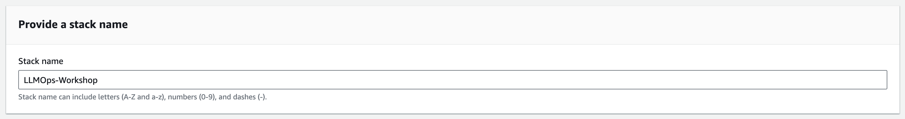
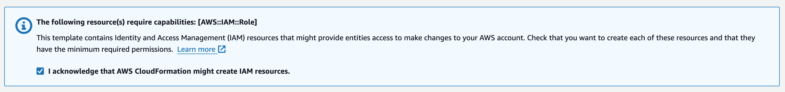

## Getting started

To get started, ensure you have an AWS account with AdministratorAccess. If you don't already have one, please create an AWS account.

## Pre-requisites

- AWS account with AdminstratorAccess
- Computer with internet connection
- A modern web browser
- Visual Studio Code
- Docker

> __NOTE:__ It is recommended that you attempt the workshop in a development container, using the provided configuration.


## Setup your environment

1. Ensure that you have the necessary dependencies installed. Skip this step if you are using the provided development container.
    - Docker
    - Python 3.11
    - Npm
    - AWS CDK 2.128.0
    - AWS CLI 2.15.21

2. Manually create a Python virtualenv:

```shell
python3 -m venv .venv
```

3. After the init process completes, use the following step to activate your virtualenv.

```shell
source .venv/bin/activate
```

4. Once the virtualenv is activated, you can install the required dependencies.

```shell
pip install -r requirements.txt
```

5. Take a look at the configuration template file `constants.py` at the root of the repository. We will use this file to customize the deployment of the workshop. You may want to update these 2 parameters, or leave them with the default values.

- `WORKLOAD_NAME`: Provide a name for the work load, e.g. `LLMOps-Workshop`
- `REGION`: Provide the name of the AWS Region you wish to use. This should be an AWS Region that Bedrock supports. The default value is `us-east-1`


## Setting up your AWS account


### 1. Deploy necessary AWS resouces

Click below link to launch the `Getting Started` CloudFormation stack.

Region|Launch URL
:--|:--
us-east-1|[Launch](https://console.aws.amazon.com/cloudformation/home?region=us-east-1#/stacks/new?stackName=LLMOps-Workshop&templateURL=https://raw.githubusercontent.com/trankimtung/aws-llmops-workshop/main/getting-started.yml)

Specify an unique stack name, or stick with the default option of `LLMOps-Workshop`. Keep all other settings in the `Specify stack details` section at their default values.



Tick the box to acknowledge that CloudFormation may generate IAM resources in your account, then click `Submit`.



Alternatively, You can run the following command in your terminal. Before executing this command, ensure your AWS credentials are properly configured.

```shell
aws cloudformation create-stack --stack-name LLMOps-Workshop --capabilities CAPABILITY_IAM --template-body file://getting-started.yml
```

> The deployment will take about 20 minutes to complete. You can monitor the progress under the `Events` tab within your CloudFormation Stack.

Once the status changes to `CREATE_COMPLETE`, you'll know that the stack has been successfully launched.


### 2. Request access to Amazon Bedrock foundation models

1. In the Management Console, search for `Amazon Bedrock`, and using the left-hand navigation panel, scroll down to select `Model Access`.

2. In the `Model access` panel, click the `Manage model access` button, in the top right-hand corner.

3. Select the check-box for Anthropic, and click the `Submit use case details` button. Fill out the use case form.

4. Click the `Submit` button.

> The base model access approval process for Stability AI, and Anthropic should take approximately 10 minutes to process.

5. Check the boxes for these models:
   -  `Titan Embeddings G1 - Text`
   -  `Titan Text G1 - Express`
   -  `Claude Instant`
   -  `SDXL 1.0`

6. Click the `Save changes` button to submit the license approval process.


## Summary

In this section, you have set up your development environment and deploy the AWS resources necessary for the workshop into your AWS accounts. These resources include a SageMaker Domain, an OpenSearch cluster, IAM roles, and more. You also submitted a request to gain access to the essential Amazon Bedrock foundation models.
