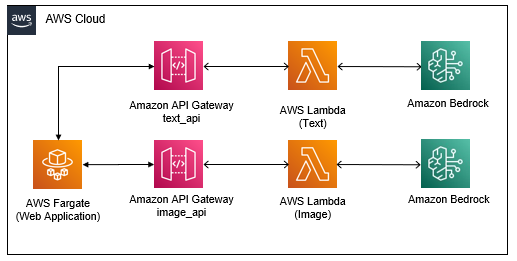
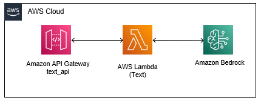
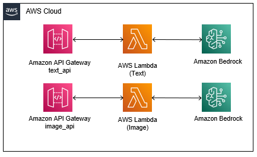
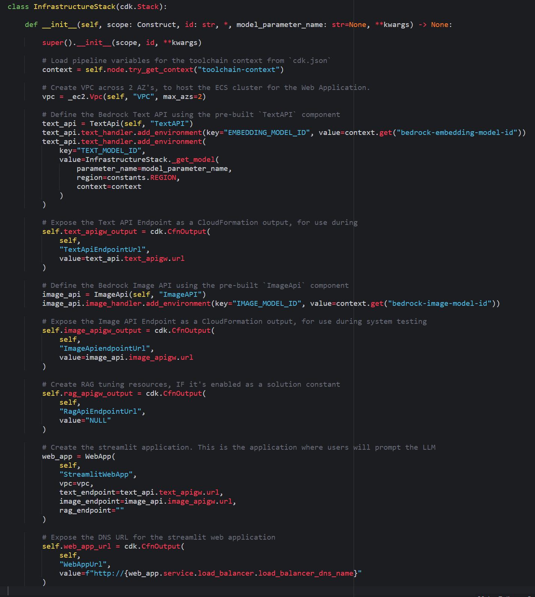

# Building the application and infrastructure code

Before implementing the Continuous Integration, Continuous Deployment, and Continuous Tuning process, you have to create both the generative AI application and its backend infrastructure. These components will be the AWS resources that are deployed by the CI/CD/CT Pipeline.

The backend infrastructure comprises an Amazon API Gateway, an AWS Lambda Function responsible for calling Amazon Bedrock, and optionally, an Amazon OpenSearch Domain if RAG is enabled. The generative AI application is a web application containerized and hosted in an ECS Fargate cluster. This application interacts with the backend APIs.

Below diagram shows the architecture you will create in this section:



Throughout this workshop, you'll construct AWS resources utilizing the [AWS Cloud Development Kit (CDK)](https://aws.amazon.com/cdk/)

In this section, you will create a infrastructure stack composed of codified CDK constructs. These constructs act as abstractions of the different AWS Services, facilitating easier management and configuration.

> Note: The AWS Cloud Development Kit (AWS CDK) is an open-source software development framework for defining cloud infrastructure in code and provisioning it through AWS CloudFormation.
>
> AWS CDK supports TypeScript, JavaScript, Python, Java, C#/.Net, and Go. You can use any of these supported programming languages to define reusable cloud components known as constructs.
> 
> Constructs are the basic building blocks of AWS Cloud Development Kit (AWS CDK) applications. A construct is a component within your application that represents one or more AWS CloudFormation resources and their configuration. You build your application, piece by piece, by importing and configuring constructs.
> 
> Constructs are available from the AWS Construct Library. You can also create and distribute your own constructs, or use constructs created by third-party developers.

## Steps

### Create the `InfrastructureStack`

1. Open the `stacks/infrastructure.py` file. 

2. For each of the following sections, copy the code into the corresponding section within the `infrastructure.py` file.

Retrieve the pipeline variables from the toolchain context. This includes essential information such as the models to utilize in the deployment and the batch size of the tuning job.

```python
        context = self.node.try_get_context("toolchain-context")
```

Define the VPC which will host the ECS Fargate Cluster.

```python
        vpc = _ec2.Vpc(self, "VPC", max_azs=2)
```

Instantiate the Text API by employing the pre-defined `TextAPI` component. Subsequently, when accessing the `Text Generation` tab of the generative AI web application, you'll notice that this component serves as the API responsible for receiving and responding to your prompt requests for text generation. The Lambda function associated with this API formats the text generation request within a prompt template, forwards the prompt to an LLM model, which in this instance is facilitated by Amazon Bedrock.

```python
        text_api = TextApi(self, "TextAPI")
        text_api.text_handler.add_environment(key="EMBEDDING_MODEL_ID", value=context.get("bedrock-embedding-model-id"))
        text_api.text_handler.add_environment(
            key="TEXT_MODEL_ID",
            value=InfrastructureStack._get_model(
                parameter_name=model_parameter_name,
                region=constants.REGION,
                context=context
            )
        )
```



Next, you will save the Text API URL as a CloudFormation Output parameter. This parameter will be leveraged by the CI/CD/CT toolchain in the automated system testing phase of the workshop.

```python
        self.text_apigw_output = cdk.CfnOutput(
            self,
            "TextApiEndpointUrl",
            value=text_api.text_apigw.url
        )
```

Next, you'll create the Image API along with its supporting Lambda function by utilizing the pre-defined `ImageAPI` component. Upon accessing the `Image Generation` tab of the generative AI web application, you'll observe that this component operates similarly to the `TextAPI` component. The API will receive your prompt for generating an image, format it within the prompt template, and then forward the prompt to the model hosted on Amazon Bedrock.

```python
        image_api = ImageApi(self, "ImageAPI")
        image_api.image_handler.add_environment(key="IMAGE_MODEL_ID", value=context.get("bedrock-image-model-id"))
```



Once again, you save the Image API URL as a Cloudformation Output parameter for later use during system testing.

```python
        self.image_apigw_output = cdk.CfnOutput(
            self,
            "ImageApiendpointUrl",
            value=image_api.image_apigw.url
        )
```

The application is expecting a RAG API. Since the RAG API is not yet integrated into the application architecture and will be added later in the workshop, you should set its value as `NULL` for the time being. This measure ensures that the system test does not encounter failures.

```python
        self.rag_apigw_output = cdk.CfnOutput(
            self,
            "RagApiEndpointUrl",
            value="NULL"
        )
```

> You'll notice that the comment mentions the `ENABLE_RAG` constant variable in `constants.py`. By default this constant is set to `False` so you do not need to change it at this point.

Next, you will define the web application, which serves as the interface for sending prompts to the models and receiving responses. This application is built using *Streamlit*, an open-source Python library that simplifies the creation of custom web apps for machine learning and data science. This component establishes an ECS Fargate cluster host the application. The specified parameters dictate the hosting location of the application and the URLs of the backend APIs that the application should utilize.

```python
        web_app = WebApp(
            self,
            "StreamlitWebApp",
            vpc=vpc,
            text_endpoint=text_api.text_apigw.url,
            image_endpoint=image_api.image_apigw.url,
            rag_endpoint=""
        )
```

Below diagram shows the components you have created until this point:


Lastly, you'll save the DNS URL of the web application as a CloudFormation Output parameter. This enables convenient access to the application after deployment.

```python
        self.web_app_url = cdk.CfnOutput(
            self,
            "WebAppUrl",
            value=f"http://{web_app.service.load_balancer.load_balancer_dns_name}"
        )
```

1. Make sure that you save the `infrastructure.py` file. After all additions, the `InfrastructureStack` class should look like this:



## Summary

In this section, you've constructed a CDK stack responsible for deploying the infrastructure needed for the Web Application, Text API, and Image API. Moving forward, you'll manually conduct integration testing to showcase what will eventually be automated by the CI/CD/CT pipeline.

[Click here to proceed to the next section.](/.docs/part-1/20-manual-unit-and-integration-test.md)
