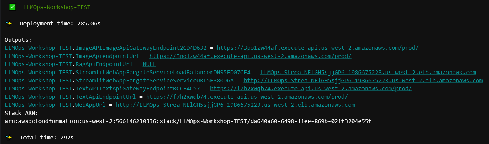

# Manual unit and integration test

Continuous Integration (CI) involves consolidating all the working copies of an application's code, merging them into a unified version, creating a build, and executing tests against it. This process guarantees that the code functions correctly before deploying the application into production. In the realm of LLMOps, this encompasses verifying the functionality of both the LLM and the generative AI application that utilizes it. To illustrate this process within the context of applications employing AWS CDK, you'll manually conduct tests that will later be automated during the Continuous Integration phase of the CI/CD/CT pipeline.

In this section, you'll execute a unit test to verify that the code compiles correctly. Additionally, you'll conduct a functional test, or integration test, to ensure that the application responds as anticipated and all components operate correctly in the development environment.


## Steps


### Add the `InfrastructureStack` to the `app.py` file

> The `app.py` file is the top-level grouping of all our application and backend infrastructure components. This is the main file which AWS CDK will interact with to understand and deploy the application, and is found in the root of the workshop repository folder.

1. Add the `InfrastructureStack` created in the previous section. This stack is utilized for standalone development and testing of the Generative AI Application, without relying on a CI/CD/CT Pipeline. Below the `InfrastructureStack`, you'll find the `ToolChainStack` section, where you'll place the code defining the CI/CD/CT Pipeline, which will be constructed later in the workshop. Copy the following code and paste it into the appropriate section under:

```python
# Create the infrastructure to be used for stand-alone TEST of the generative AI application
```

```python
InfrastructureStack(
    app,
    f"{constants.WORKLOAD_NAME}-TEST",
    env=cdk.Environment(
        account=boto3.client("sts").get_caller_identity().get("Account"),
        region=constants.REGION
    )
)
```

2. Make sure to save the `app.py` file.

### Bootstrap CDK

Now that you have the CDK Stack ready for deployment, you'll need to ensure that the environment (AWS Account and Region) where you're deploying has the necessary resources for AWS CDK to proceed with the deployment. This is achieved through bootstrapping.

During bootstrapping, AWS CDK will create several resources in your environment to facilitate application deployment. These resources typically include an Amazon S3 Bucket, an AWS Key Management Service (KMS) Key, Amazon Identity and Access Management (IAM) Roles, an Amazon Elastic Container Registry (ECR) repository, and an Amazon Systems Manager (SSM) parameter for versioning.

To start bootstrapping, use the bootstrap CDK command.

```shell
export AWS_ACCOUNT_ID=$(aws sts get-caller-identity --query Account --output text)
export AWS_DEFAULT_REGION=us-east-1
export AWS_REGION=us-east-1
cdk bootstrap aws://$AWS_ACCOUNT_ID/$AWS_REGION --cloudformation-execution-policies arn:aws:iam::aws:policy/AdministratorAccess
```

> Note: CDK bootstrapping should take approximately 2 minutes to complete.

With the environment now bootstrapped, you're ready to proceed with manual integration testing.

### Unit test

In software development, the initial test typically performed is the Unit Test, ensuring that the application "compiles" successfully. As you're constructing the entire solution as a CDK application, you can achieve this by synthesizing the deployable resources, which exist in the form of application assets and AWS CloudFormation templates.

In your terminal, run:

```shell
cdk synth
```

> Note: A successful synthesis means that the CloudFormation template (which is created behind the scenes using the CDK) is deployable and all application assets are successfully created. If the synthesis succeeds, the CloudFormation template and assets are located in a folder called `cdk.out` within your application folder. The template file name ends in `.template.json`.

If you do not receive any errors, proceed to the next step.

### Integration test

Perform an integration test by manually deploying the application and using the web application to simulate different use cases.

First, deploy the application into development environment. In the terminal, run:

```shell
cdk deploy --require-approval never --verbose
```

When deployment is complete, your output should look like this:



Follow the URL of `WebAppUrl` output to access the web application and start testing.

### Delete test stack

Now that you've confirmed the application functions as intended, you'll proceed to delete this test stack. In your terminal, execute the following command:

```shell
cdk destroy
```

## Summary

In this segmesectionnt, you manually executed the integration and deployment phases of LLMOps by conducting unit and integration testing on both the infrastructure and generative AI application code. In the subsequent section, you'll encapsulate the solution within a CI/CD Pipeline to automate these processes.

[Click here to proceed to the next section.](/.docs/part-1/30-create-a-cicd-llmops-pipeline.md)