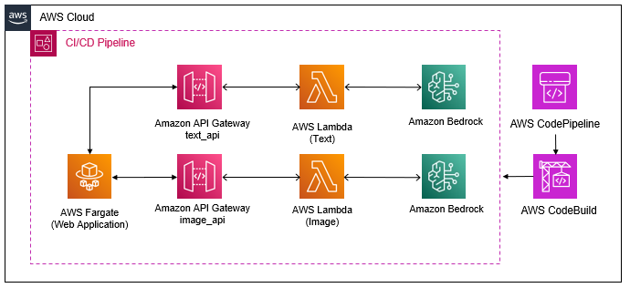
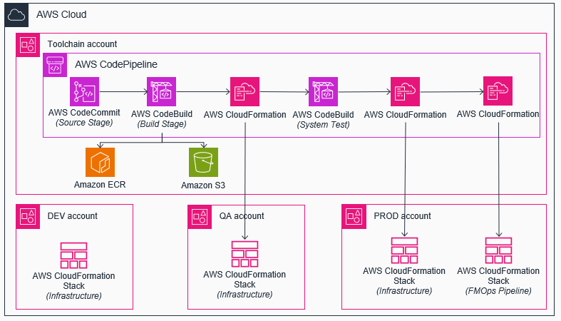
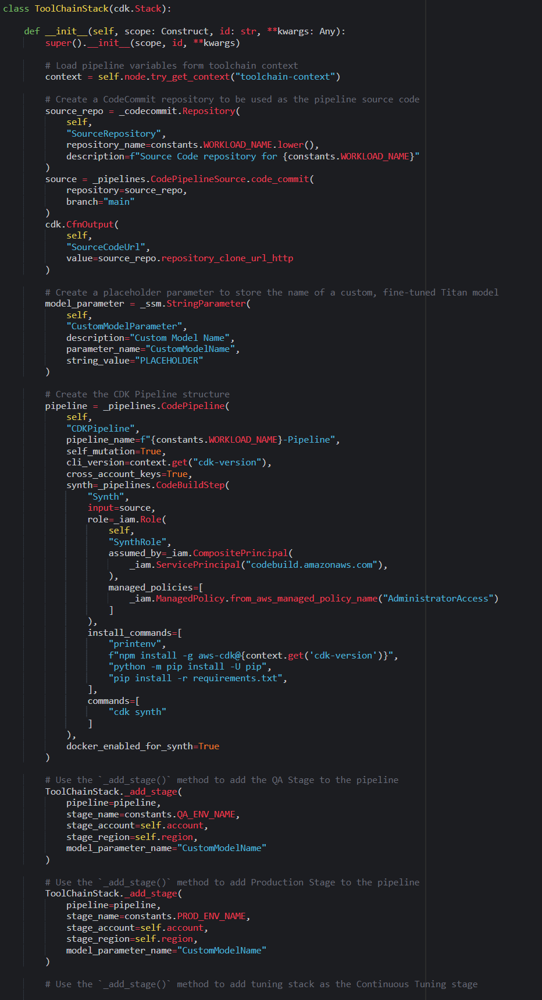
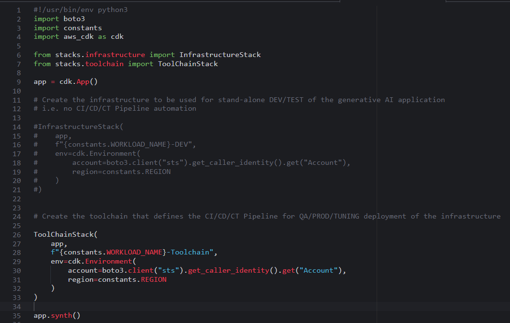
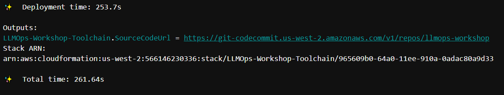

# Create a Continuous Integration / Continuous Deployment (CICD) Pipeline

Now that you've manually executed the tests and confirmed the functionality of the solution, the next step is to automate the process by encapsulating the solution within a CI/CD Pipeline. This pipeline will handle the deployment of the end-to-end application infrastructure and automatically conduct tests to ensure that the various components interact successfully. Upon passing this system test, the solution will be deemed ready for deployment into production.

This diagram shows the architecture with a CI/CD Pipeline backed by AWS CodePipeline.



Behind the scenes, this is what the pipeline is automatically executing:



The AWS CloudFormation Stack shown in each of the different environments/accounts, is the `InfrastructureStack` that you created and tested earlier in the workshop. Any changes you make to the `InfrastructureStack`, once committed to the CodeCommit repository, will be deployed to all environments, assuming the automated system tests for each environment pass.

The AWS CloudFormation Stack displayed in each of the distinct environments/accounts corresponds to the `InfrastructureStack` created and verified earlier in the workshop. Any modifications made to the `InfrastructureStack`, once committed to the CodeCommit repository, will be deployed across all environments, upon the successful completion of the automated system tests for each environment.


## Steps

### Create the `ToolChainStack`

1. Open the `stacks/toolchain.py` file.

2. For each of the following sections, copy the code into the corresponding section of the `toolchain.py` file

Retrieve the pipeline variables from the toolchain context. This includes essential information such as the models to utilize in the deployment and the batch size of the tuning job.

```python
        context = self.node.try_get_context("toolchain-context")
```

Create a CodeCommit repository to store the application source code. In addition to creating the repository, you also define the repository as the source for the CodePipeline.

```python
        source_repo = _codecommit.Repository(
            self,
            "SourceRepository",
            repository_name=constants.WORKLOAD_NAME.lower(),
            description=f"Source Code repository for {constants.WORKLOAD_NAME}"    
        )
        source = _pipelines.CodePipelineSource.code_commit(
            repository=source_repo,
            branch="main"
        )
        cdk.CfnOutput(
            self,
            "SourceCodeUrl",
            value=source_repo.repository_clone_url_http
        )
```

Create a placeholder parameter to store the name of a custom, fine-tuned model. The value of this parameter will change what model the pipeline deploys for your web application to use. Since you are not currently doing any fine-tuning, the parameter will be set to `PLACEHOLDER`.

```python
        model_parameter = _ssm.StringParameter(
            self,
            "CustomModelParameter",
            description="Custom Model Name",
            parameter_name="CustomModelName",
            string_value="PLACEHOLDER"
        )
```

Create the CDK Pipeline structure. This defines what actions will occur during the Build phase of the pipeline.

```python
        pipeline = _pipelines.CodePipeline(
            self,
            "CDKPipeline",
            pipeline_name=f"{constants.WORKLOAD_NAME}-Pipeline",
            self_mutation=True,
            cli_version=context.get("cdk-version"),
            cross_account_keys=True,
            publish_assets_in_parallel=False,
            synth=_pipelines.CodeBuildStep(
                "Synth",
                input=source,
                role=_iam.Role(
                    self,
                    "SynthRole",
                    assumed_by=_iam.CompositePrincipal(
                        _iam.ServicePrincipal("codebuild.amazonaws.com"),
                    ), 
                    managed_policies=[
                        _iam.ManagedPolicy.from_aws_managed_policy_name("AdministratorAccess")
                    ]
                ),
                install_commands=[
                    "printenv",
                    f"npm install -g aws-cdk@{context.get('cdk-version')}",
                    "python -m pip install -U pip",
                    "pip install -r requirements.txt",
                ],
                commands=[
                    "cdk synth"
                ]
            ),
            docker_enabled_for_synth=True
        )
```

Use the `_add_stage()` method to add the QA Stage to the pipeline. This stage is responsible for deploying the solution within a QA environment, where functional testing of the solution, simulating production-like conditions, is automated.

```shell
        ToolChainStack._add_stage(
            pipeline=pipeline,
            stage_name=constants.QA_ENV_NAME,
            stage_account=self.account,
            stage_region=self.region,
            model_parameter_name="CustomModelName"
        )
```

Use the `_add_stage()` method to add Production Stage to the pipeline

```python
        ToolChainStack._add_stage(
            pipeline=pipeline,
            stage_name=constants.PROD_ENV_NAME,
            stage_account=self.account,
            stage_region=self.region,
            model_parameter_name="CustomModelName"
        )
```

> Note: Integrating both QA and Production Stages adheres to best practices by facilitating the testing of the solution within a distinct environment prior to deployment to a production. Given that the QA and Production stages are sequenced within the CodePipeline, if the System Tests stage fails, the pipeline halts before progressing to the next stage. Consequently, by positioning QA before Production, successful completion of QA tests and deployment signifies that the updates are ready for production deployment.

Leave the Continuous Tuning stage blank. You will add this stage in the next section.

3. Make sure to save the `toolchain.py` file.

After all additions, the `ToolChainStack` class should look like this:




### Add the toolchain to `app.py`

1. Open the `app.py` file.
   
2. Comment out the code associated with the test `InfrastructureStack`, as you will now deploy the CI/CD pipeline, instead of the test environment.
   
3. Paste in the code below so now CDK will deploy the new `ToolChainStack`.

```python
        ToolChainStack(
            app,
            f"{constants.WORKLOAD_NAME}-Toolchain",
            env=cdk.Environment(
                account=boto3.client("sts").get_caller_identity().get("Account"),
                region=constants.REGION
            )
        )
```

4. Save the `app.py` file.

The `app.py` file should now look like this:




### Deploy the pipeline

In the terminal, run:

```shell
cdk deploy --require-approval never --verbose
```

> Note: Deployment will take about 5 minutes to complete.

You should see the following output upon a successful deployment of the CI/CD pipeline, as follows:




### Execute the pipeline

1. In the AWS Management Console, navigate to the CodePipeline service. You'll observe that the most recent execution has failed. This is expected since no code has been committed to the CodeCommit Repository yet.
   
2. In the AWS Management Console, locate and click on the CodeCommit service. You'll observe that the repository defined in the `toolchain.py` file is indeed empty.

3. Run the following commands to push the source code to the new CodeCommit repository.

```shell
git add -A
git commit -m "ci: setup cicd pipeline"
pip install git-remote-codecommit
git remote add ccm codecommit::us-east-1://llmops-workshop
git push ccm main
```

4. Using the AWS Management Console, refresh the CodeCommit Repository page. You'll now see that the repository is populated with the source code. With the code now stored in a repository and integrated into a CI/CD Pipeline, any modifications made to the source code will initiate a pipeline execution.

5. In the AWS console, search for, and click on the CodePipeline service. Notice that now instead of `Failed`, the most recent execution is `In progress`. The code pipeline is now able to execute the stages you built in the `toolchain.py` file. When any modifications are made to the source code, regardless of whether to the components, infrastructure stack, toolchain stack, or other files, the toolchain is automatically updated and the pipeline is re-executed. At each stage, the pipeline checks to see if the changes affected the current stage, and if it does, automatically makes the necessary changes. This is the self-mutating piece of the pipeline. You can now see a visual of the QA and Prod stages that you added to the pipeline.

6. Wait for the pipeline to finish.

> Note: The CI/CD pipeline execution should take approximately 20 minutes to complete.

### Explore QA and Prod application

1. After the pipeline completes, use the AWS Management Console to search for and access the CloudFormation service. Select the QA stack and navigate to the Outputs tab.

2. Click on the URL value associated with `WebAppUrl`.

3. Repeat steps 1 and 2 for the Prod environment.

4. You can also click on the View logs link for the SystemTests action within the QA stage. This will display the results of the automated system test that need to pass before the solution can be deployed into production.


## Summary

In this section, you've completed the integration of your solution into a CI/CD Pipeline, deployed the updated solution, and tested it in both QA and Prod environments. Next, you'll enhance the pipeline by introducing a continuous tuning stage, enabling automated model tuning and evaluation. If the model demonstrates improved performance, it can be smoothly deployed into production.

[Click here to proceed to the next section.](/.docs/part-2/40-continous-tuning-using-fmops.md)