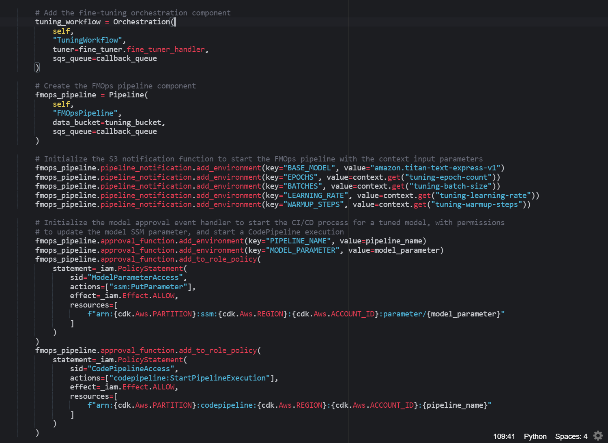

# Continuous Fine-tuning using FMOps

Continuous Tuning is the iterative refinement process of a foundation model using a labeled dataset. This process deviates from the traditional Continuous Training approach in MLOps, where the focus is on retraining classical or deep-learning ML models.

Continuous Training, within the context of the MLOps methodology, is to retrain a model with additional data and optimizes the model by tweaking hyperparameters to create a new version of the model. This process consists of performing various steps, such as data pre-processing, model training, model evaluation, and model versioning. 

On AWS, this process can be automated using Amazon SageMaker Pipelines. As illustrated in the image below, when new data is provided, either in Amazon S3 or another designated location, a SageMaker pipeline is executed to automate the steps of pre-processing the data, starting a SageMaker training job, evaluating the model, and the evaluation metric shows improvement, register the model version in the model registry. The model can then be used within the application.


When using the LLMOps methodology to build end-to-end generative AI applications, the continuous training stage - typically associated with MLOps - now becomes a continuous fine-tuning stage. This is where FMOps, a subset of MLOps for fine-tuning Foundation Models is used. 

Amazon Bedrock enables the fine-tuning of various foundation models using your labeled tuning dataset to enhance model performance on domain-specific tasks. However, as Amazon SageMaker Pipelines don't currently offer direct integration with Bedrock fine-tuning, we automate the fine-tuning stage of FMOps with a Callback Step. In this setup, SageMaker Pipeline employs a callback step to dispatch a message to an Amazon Simple Queue Service (SQS) queue, initiating a serverless Amazon Step Functions workflow. This workflow coordinates AWS Lambda Functions responsible for orchestrating the Bedrock fine-tuning process. Once the Bedrock model fine-tuning has completed, the SageMaker Pipeline evaluates the performance metrics associated with the fine-tuned model and stores the fine-tuned model metadata in the SageMaker Model Registry. Data Scientists, or ML practitioners can then evaluate the new model version to determine whether it is a viable candidate for production release. It's at this stage of the process, where FMOps mirrors the MLOps process - upon approving the fine-tuned model version, the CI/CD pipeline automates the integration and deployment of the generative AI application to leverage the new model version. The entire fine-tuning process is triggered when labeled domain data is uploaded to an S3 bucket.

The following diagram illustrates this process, and the architecture you will be creating when you add the continuous tuning stage to the CI/CD pipeline:


> Note: Once a fine-tuned model has been approved for production and the CI/CD pipeline is triggered, the value of the Amazon Systems Manager Parameter Store parameter is updated from "PLACEHOLDER" to the name of the new model. During the Build Stage of the CI/CD pipeline, the infrastructure artifacts are updated with the new model, prompting the re-deployment of the QA and PROD stages to utilize the fine-tuned model. This integration demonstrates how FMOps is incorporated into the LLMOps process.

In this section, you will add the continuous tuning stage to the `ToolChainStack`. You will then upload data to an S3 bucket, which will trigger the SageMaker Pipeline that fine-tunes the FMs with the provided data.

> Note: The fine-tuning process will take about 1.5 hour to complete.


## Steps


### Configure solution constants

1. In the AWS Management Console, navigate to the CloudFormation service.
   
2. Click on the getting started stack `LLMOps-Workshop` created at the beginning of the workshop.
   
3. Select the `Outputs` tab and note down the value for the `SageMakerDomainID` parameter.
   
4. Open the `constants.py` file in the root of the workshop repository.

5. Set the `SAGEMAKER_DOMAIN_ID` variable to be equal to the `SageMakerDomainID` value.

> Given that the FMOps process is automated using a SageMaker Pipeline, all monitoring and management of the pipeline execution occurs within the Amazon SageMaker Studio IDE. By introducing the SageMaker Studio Domain ID as a solution constant, we grant the SageMaker Execution Role the capability to build, deploy, and oversee the FMOps pipeline.

1. Make sure to save the `constants.py` file.


### Create the `TuningStack`

1. Open the `stacks/tuning.py` file
   
2. For each of the following sections, copy the code into the corresponding section of the `tuning.py` file

Retrieve the pipeline variables from the toolchain context. This loads the model customization values, such as Epochs, Batch size, Learning rate, and Learning warmup steps. These parameters are used to tweak the fine-tuning process for the custom model.

```python
context = self.node.try_get_context("toolchain-context")
```

Create the S3 buckets, which will trigger the fine-tuning model customization process when a tuning dataset is uploaded.

```python
        tuning_bucket = _s3.Bucket(
            self,
            "TuningDataBucket",
            bucket_name=f"{self.stack_name.lower()}-{cdk.Aws.REGION}-{cdk.Aws.ACCOUNT_ID}",
            removal_policy=cdk.RemovalPolicy.DESTROY,
            auto_delete_objects=True,
            versioned=True
        )
        cdk.CfnOutput(self, "TuningDataBucketName", value=tuning_bucket.bucket_name)
```

Create an Amazon Bedrock service IAM role that grants Bedrock access permissions to the tuning data in the tuning_bucket.

```python
        bedrock_role = _iam.Role(
            self,
            "BedrockServiceRole",
            assumed_by=_iam.ServicePrincipal(
                service="bedrock.amazonaws.com",
                conditions={
                    "StringEquals": {
                        "aws:SourceAccount": cdk.Aws.ACCOUNT_ID
                    },
                    "ArnEquals": {
                        "aws:SourceArn": f"arn:{cdk.Aws.PARTITION}:bedrock:{cdk.Aws.REGION}:{cdk.Aws.ACCOUNT_ID}:model-customization-job/*"
                    }
                }
            ),
            inline_policies={
                "BedrockS3Policy": _iam.PolicyDocument(
                    statements=[
                        _iam.PolicyStatement(
                            actions=[
                                "s3:GetObject",
                                "s3:PutObject",
                                "s3:ListBucket"
                            ],
                            effect=_iam.Effect.ALLOW,
                            resources=[
                                f"arn:{cdk.Aws.PARTITION}:s3:::{tuning_bucket.bucket_name}",
                                f"arn:{cdk.Aws.PARTITION}:s3:::{tuning_bucket.bucket_name}/*"
                            ],
                            conditions={
                                "StringEquals": {
                                    "aws:PrincipalAccount": cdk.Aws.ACCOUNT_ID
                                }
                            }
                        )
                    ]
                )
            }
        )
```

Define the SQS callback queue that integrates the fine-tuning workflow processes with the FMOps SageMaker Pipeline. As mentioned earlier, there is currently no direct integration between a SageMaker Pipeline and Bedrock. The SQS queue acts as the bridge between the FMOps pipeline Callback step and the Bedrock model customization workflow.

```python
        callback_queue = _sqs.Queue(
            self,
            "CallbackQueue",
            visibility_timeout=cdk.Duration.seconds(120)
        )
```

Add the fine-tuning handler, using the pre-defined `FineTuner` component. This component consists of a Lambda function that creates the fine-tuning job to customize the foundation model. The Lambda function also monitors the status of the fine-tuning job, and reports the status back to the FMOps pipeline.

```python
        fine_tuner = FineTuner(self, "FineTuner")
```

With the fine-tuning handler defined, we now add the Bedrock service role as an environment variable. This allows the Lambda function to pass the Bedrock service role when starting, and monitoring the fine-tuning job.

```python
        fine_tuner.fine_tuner_handler.add_environment(key="BEDROCK_ROLE", value=bedrock_role.role_arn)
```

Next, create the fine-tuning workflow, using the pre-defined workflow `Orchestration` component. This component is an AWS Step Functions workflow that coordinates the fine-tuning handler.

```python
        tuning_workflow = Orchestration(
            self,
            "TuningWorkflow",
            tuner=fine_tuner.fine_tuner_handler,
            sqs_queue=callback_queue
        )
```

The Step Functions flow is illustrated below. The workflow leverages the fine-tuning handler to start the Bedrock model customization job. After a 10-minute wait period, the workflow orchestrates the fine-tuning handler to verify the status of the model customization job. If the status indicates that the customization process is `InProgress`, the workflow waits another 10 minutes before checking the status again. Once the status shows that the customization process is `Complete`, the workflow reports a `Success` state back to the FMOps pipeline. Should the customization process fail, or be manually terminated, the workflow reports a `Failure` state back to the FMOps pipeline.


Next, we add the FMOps pipeline, using the pre-defined `Pipeline` component. This component is an Amazon SageMaker Pipeline that is triggered once fine-tuning data is uploaded to the S3 bucket.

```python
        fmops_pipeline = Pipeline(
            self,
            "FMOpsPipeline",
            data_bucket=tuning_bucket,
            sqs_queue=callback_queue
        )
```

In the above code, the `tuning_bucket` and `callback_queue` are specified as arguments, linking the Pipeline to the data in S3, and using the SQS queue to connect it to the Bedrock model customization workflow, by means of a Callback step. The following image shows what the FMOps pipeline looks like in the Amazon SageMaker Studio IDE:


The pipeline is structured as a directed acyclic graph (DAG). detailing each step of the pipeline along with the relationships between them. The data dependencies are encoded between each step, where the properties of a step's output are passed as an input to the next step. Each step is described below:

1. The `DataPreprocessing` step of the FMOps pipeline runs a SageMaker Processing job to read the fine-tuning data and split it into separate training and validation datasets. Once these datasets are created and stored in the tuning bucket, these data dependencies are passed onto the `FineTuning` step.

2. `FineTuning` is a Callback step to start the fine-tuning orchestration workflow. If the model customization process is successfully completed, the validation metric data dependencies are passed onto the `ModelEvaluation` step.

3. `ModelEvaluation` executes another processing job to extract, and store these metrics as metadata.

4. `RegisterModel` stores the model customization metadata for the model version, as model package in the SageMaker Model Registry. As you will learn later in this section, having a model version allows the Data Scientist, or ML Practitioner to review the model metrics, asses the quality of the custom model, purchase Provisioned Throughput, and approve (or deny) the model version for production.

> Note: The SageMaker Pipeline definition for FMOps has been codified as a CDK construct using the Pipelines SDK , and can reviewed in the `/components/fmops_pipeline/pipeline.py` file.

With the pre-defined components declared, we can add the toolchain context variables - as Pipeline parameters  - to initialize the FMOps process.

```python
        fmops_pipeline.pipeline_notification.add_environment(key="BASE_MODEL", value="amazon.titan-text-express-v1")
        fmops_pipeline.pipeline_notification.add_environment(key="EPOCHS", value=context.get("tuning-epoch-count"))
        fmops_pipeline.pipeline_notification.add_environment(key="BATCHES", value=context.get("tuning-batch-size"))
        fmops_pipeline.pipeline_notification.add_environment(key="LEARNING_RATE", value=context.get("tuning-learning-rate"))
        fmops_pipeline.pipeline_notification.add_environment(key="WARMUP_STEPS", value=context.get("tuning-warmup-steps"))
```

Next you initialize the model approval event handler that starts the CI/CD release change. This allows you to redeploy the generative AI application and its infrastructure into production, once the ML practitioners have approved the fine-tuned model.

```python
        fmops_pipeline.approval_function.add_environment(key="PIPELINE_NAME", value=pipeline_name)
        fmops_pipeline.approval_function.add_environment(key="MODEL_PARAMETER", value=model_parameter)
        fmops_pipeline.approval_function.add_to_role_policy(
            statement=_iam.PolicyStatement(
                sid="ModelParameterAccess",
                actions=["ssm:PutParameter"],
                effect=_iam.Effect.ALLOW,
                resources=[
                    f"arn:{cdk.Aws.PARTITION}:ssm:{cdk.Aws.REGION}:{cdk.Aws.ACCOUNT_ID}:parameter/{model_parameter}"
                ]
            )
        )
        fmops_pipeline.approval_function.add_to_role_policy(
            statement=_iam.PolicyStatement(
                sid="CodePipelineAccess",
                actions=["codepipeline:StartPipelineExecution"],
                effect=_iam.Effect.ALLOW,
                resources=[
                    f"arn:{cdk.Aws.PARTITION}:codepipeline:{cdk.Aws.REGION}:{cdk.Aws.ACCOUNT_ID}:{pipeline_name}"
                ]
            )
        )
```

1. Make sure to save the `tuning.py` file. After all additions, the `TuningStack` class should look like this:





### Add the Continuous Tuning Stage to the CI/CD Toolchain

1. Open the `stacks/toolchain.py` file.

2. Copy the following code into the corresponding section to use the `_add_stage()` method to add tuning stack as the Continuous Tuning stage:

```python
        ToolChainStack._add_stage(
            pipeline=pipeline,
            stage_name="TUNING",
            stage_account=self.account,
            stage_region=self.region,
            model_parameter_name="CustomModelName"
        )
```

3. Save the `toolchain.py` file.

4. Commit and push the change to CodeCommit.

```python
git add -A
git commit -m "ci: add continuous tuning stage"
git push ccm main
```

5. In the AWS console, search for, and open the CodePipeline service console. Select the workshop Pipeline.

6. Wait for the pipeline to execute, and after the `UpdatePipeline` stage has executed, you'll notice that the pipeline has self-mutated, and the Tuning stage has been added at the end.


### Tune the model

1. Take a look at the tuning data set at `tuning-data/data.jsonl`.
   
The provided dataset is a sample of the `cnn_dailymail` dataset, available from [Hugging Face](https://huggingface.co/datasets/cnn_dailymail), and released under the Apache-2.0 License. It has been pre-processed to fit the formatting requirements of Amazon Bedrock. For example, the original data is comprised of the news article, the article highlights summarization, and the article id columns. To fit the Bedrock requirements, the provided dataset has been reformatted as follows, and stored as a JSON lines formatted file:

```json
{"input": "<article>", "output": "<highlights>"}
{"input": "<article>", "output": "<highlights>"}
{"input": "<article>", "output": "<highlights>"}
...
```

2. Upload the data file to the tuning S3 bucket, with the following command, to trigger the fine-tuning process:

```shell
export WORKLOAD=$(python -c "import constants; print(constants.WORKLOAD_NAME.lower())")
export BUCKET=s3://$WORKLOAD-tuning-$AWS_REGION-$AWS_ACCOUNT_ID
aws s3 sync ./tuning-data $BUCKET/raw-data/
```

3. Using the AWS console, search for, and click on the Amazon SageMaker service to open the service console. Using the navigation panel on the left-hand side, click on Studio.

4. Select the `LLMOpsWorkshop` domain.

5. Next to the `sagemakeruser` user profile, click on Studio to launch the SageMaker Studio IDE.

6. Once the SageMaker Studio IDE has launched, on the left-hand navigation panel select Pipelines and then click on the `<WORKLOAD-NAME>-FMOpsPipeline` pipeline, and double-click on the most up to date Execution to view the execution graph.

7. Wait for the FMOps pipeline to finish executing.

> Note: The FMOps pipeline execution should take approximately 1.5 hour to complete.

When it completes, the pipeline will look as follows:


The `DataPreprocessing` step of the FMOps pipeline runs the SageMaker Processing job to take the sample dataset that was uploaded to S3, and split the data into a Train and Validation set. The Processing job then stores these datasets in the tuning S3 bucket.

> Note: Each of these datasets has only a single sample. This has been done to speed up the tuning process and save time during the workshop. The runtime logic to run this pre-processing task can be viewed in the `/workshop-code/components/fmops_pipeline/scripts/preprocessing.py` file.

The `FineTuning` step uses SQS to send a message to the Step Functions workflow which orchestrates the Bedrock model customization job, using the Train and Validation datasets from the `DataPreprocessing` step. The execution of the Step Function workflow can be viewed by searching for and clicking on the Step Functions service console. When complete, the execution for the `TuningWorkflow` will look as follows:


> Note: You can also see the the Bedrock tuning job, by searching for Amazon Bedrock in the AWS console. Once the Bedrock console is open, use the left-hand navigation panel to select Custom models. For details about the training job, select the Training Jobs tab on the Custom Models page.

The `ModelEvaluation` step of the FMOps pipeline opens the `validation_metrics.csv` file, which is an output from the `FineTuning` step, and reads the Perplexity score for the fine-tuned model on the validation dataset. This metric, along with the validation Loss metric are stored in the tuning S3 bucket.

> Note: The Perplexity score is an objective evaluation metric to determine how well the model predicts the next token sequence on the validation dataset. Lower values indicate a more accurate model.

The final step of the FMOps pipeline is the `RegisterModel` step. This step captures the validation metric output from the `ModelEvaluation` step and stores these as metadata in the SageMaker Model Registry.

At is at this point that the ML Practitioner views the perplexity score of the model version, and assess the custom model's performance against the key performance indicators for the use case. If the model meets the production criteria, the ML Practitioner can perform one or more of the following tasks:

- Purchase [Provisioned Throughput](https://docs.aws.amazon.com/bedrock/latest/userguide/prov-throughput.html) for the model version.
- Manually perform use case specific prompt tests against the model version.
- Execute automated prompt tests against the model version, using the test dataset.
- Perform robust model evaluation of the custom version to ascertain use case specific performance criteria. For example, if the output is unstructured (such as a summary), they can use similarity metrics like Recall-oriented Understudy for Gisting Evaluation [ROUGE](https://en.wikipedia.org/wiki/ROUGE_(metric)), and cosine similarity. See [Model evaluation](https://docs.aws.amazon.com/bedrock/latest/userguide/model-evaluation.html) for more information on how Bedrock support model evaluation jobs.

Once the model version has been deemed suitable for production, it can be manually approved.


### Approve the model for production

1. To approve a model for production, use the SageMaker Studio IDE, expand the `Models` menu option in the left-hand navigation panel, and select the Model registry option.

2. Click the `<WORKLOAD NAME>-PackageGroup` group, and click the latest version of the model package.

3. Use the `Actions` button, in the top-right, select the `Update status` option from the drop-down, and then click the `Approved` option.

4. In the Approve model version dialog window, provide an option comment for approval, and then click the `Save and update` button.

5. Use the AWS console to search for, and open the CodePipeline console. Select the CI/CD/CT pipeline to see release change to re-deploy the generative AI application, and Bedrock backend to use the new custom model.

## Summary

In this section, you added a continuous tuning stage to the CodePipeline, automatically fine-tuned your model, and saw how the CI/CD/CT pipeline automatically updated and deployed the generative AI application to use the new model. In the next section, you will deploy a way to add context to your prompts and query data without having to fine-tune a model.

[Click here to proceed to the next section.](/.docs/part-2/50-retrieval-augmented-generation.md)
