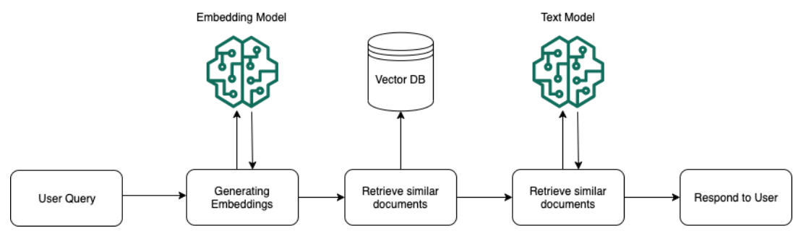
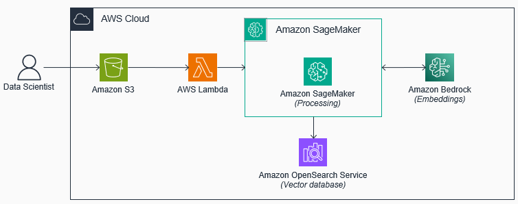
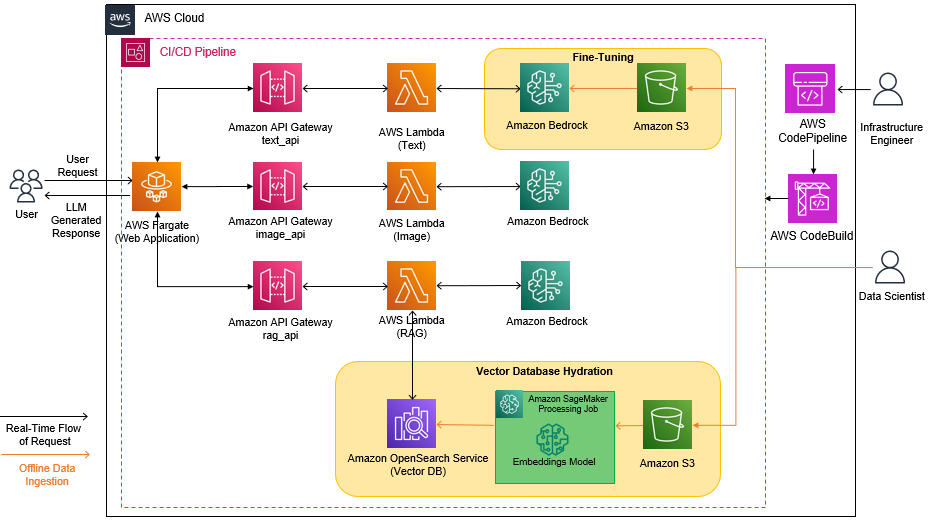
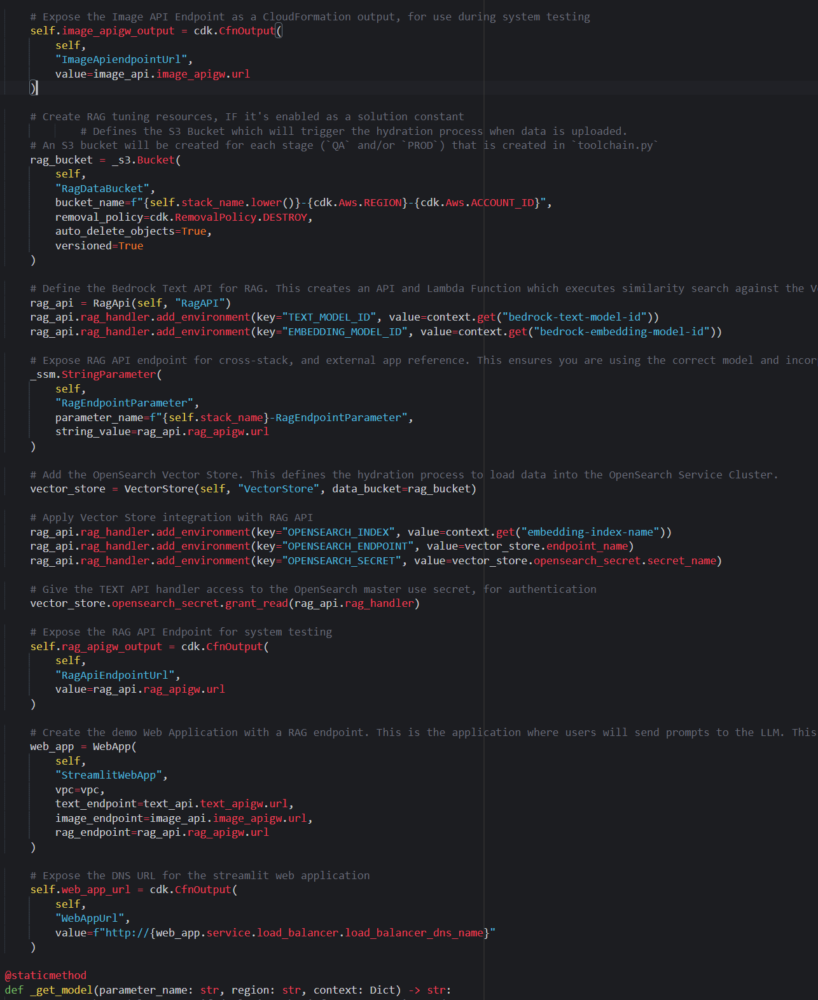

# Retrieval Augmented Generation

Retrieval Augmented Generation (RAG) is an LLM grounding technique that is used to provide additional context to LLMs, such as documents and domain specific data. To enable RAG, the documents/data and their embeddings are stored in a Vector Database. When a prompt is submitted to the model, a similarity search is performed on the Vector Database to identify relevant information to include in the prompt. The prompt, query context, and retrieved information from the Vector Database are then used as inputs to the LLM, resulting in an "augmented" output that incorporates the retrieved information.



RAG holds significant appeal for organizations concerned with safeguarding the intellectual property and security of their domain data. Through RAG, it's possible to provide secure and governed access to Foundation Models (FMs) without directly integrating the data into the model through processes like re-training or fine-tuning. This approach enables organizations to maintain control over sensitive data while still benefiting from the enhanced capabilities provided by FMs.

Just as Continuous Tuning can be automated within the LLMOps process, we can also integrate Retrieval Augmented Generation (RAG) to ensure that the Foundation Model (FM) remains current and up-to-date with the latest data and information. LLMOps enables continuous preprocessing of documents and data, which includes tasks such as chunking text, computing embeddings, and storing the information in Vector Databases. As additional information is incorporated into the Vector Database, the model becomes better equipped to offer accurate responses.

The process is illustrated below:



In this section, you will add the RAG Components to the InfrastructureStack, which will redeploy the solution with an Amazon S3 bucket, Amazon OpenSearch Service Cluster, and an AWS Lambda Function. You will then take the open-source ebook, [Treasure Island by Robert Louis Stevenson](https://www.gutenberg.org/ebooks/120), break the text into composable passages, capture the vectorized representation of each passage using the Titan embeddings model, and then hydrate the Amazon OpenSearch Service database index with these embeddings. Finally, you will use the web application to prompt the Bedrock model with Treasure Island specific questions, and see how the model augments it's response with this context. By the end of this section, your architecture will look as follows:




## Steps


### Reset model

In the previous section, the toolchain was configured to use the fine-tuned custom model. Since RAG is an alternate methodology to fine-tuning, the following steps will reset the model parameter to use the foundation model:

1. In your terminal, run the AWS CLI command to update the AWS Systems Manager Parameter Store parameter value to `PLACEHOLDER`.

```shell
aws ssm put-parameter --name CustomModelName --value PLACEHOLDER --overwrite
```

2. Verify the parameter is set to `PLACEHOLDER`, by running the following CLI command:

```shell
aws ssm get-parameter --name CustomModelName --query "Parameter.Value"
```


### Enable RAG

Since enabling RAG is solution constant, the following steps will configure RAG for the workload:

1. Open the `constants.py` file in the root folder of the workshop repository.

2. Set `ENABLE_RAG` equal to `True`, and save the file.

3. In the AWS Console, navigate to CloudFormation service.

4. Click on the getting started stack `LLMOps-Workshop` created at the beginning of the workshop.

5. Select the Outputs tab and note down the values for both the `OpenSearchDomainEndpoint`, and `OpenSearchSecret` parameters.

6. In the `constants.py` file, set the `OPENSEARCH_ENDPOINT` parameter to be equal to the `OpenSearchDomainEndpoint` value, and set `OPENSEARCH_SECRET_ARN` equal to the `OpenSearchSecret` value.

7. Save the `constant.py` file.


### Update the `InfrastructureStack`

1. Open `stacks/infrastructure.py`.

2. Delete the code immediately under the following comment

```python
# Create RAG tuning resource, IF it's enabled as a solution constant
```

3. Delete the following comments, as well as the code that goes with it:

```python
# Create the streamlit application. This is the application where users will prompt the LLM
```

4. Delete the following comments and the code that goes with it:

```python
# Expose the DNS URL for the streamlit web application
```

5. Now, copy the following code and paste it under:

```python
# Create RAG tuning resource, IF it's enabled as a solution constant
```

```python
        # Defines the S3 Bucket which will trigger the hydration process when data is uploaded.
        # An S3 bucket will be created for each stage (`QA` and/or `PROD`) that is created in `toolchain.py`
        rag_bucket = _s3.Bucket(
            self,
            "RagDataBucket",
            bucket_name=f"{self.stack_name.lower()}-{cdk.Aws.REGION}-{cdk.Aws.ACCOUNT_ID}",
            removal_policy=cdk.RemovalPolicy.DESTROY,
            auto_delete_objects=True,
            versioned=True
        )

        # Define the Bedrock Text API for RAG. This creates an API and Lambda Function which executes similarity search against the Vector Database before prompting the model in Bedrock
        rag_api = RagApi(self, "RagAPI")
        rag_api.rag_handler.add_environment(key="TEXT_MODEL_ID", value=context.get("bedrock-text-model-id"))
        rag_api.rag_handler.add_environment(key="EMBEDDING_MODEL_ID", value=context.get("bedrock-embedding-model-id"))

        # Expose RAG API endpoint for cross-stack, and external app reference. This ensures you are using the correct model and incorporating RAG for text generation within your application.
        _ssm.StringParameter(
            self,
            "RagEndpointParameter",
            parameter_name=f"{self.stack_name}-RagEndpointParameter",
            string_value=rag_api.rag_apigw.url
        )

        # Add the OpenSearch Vector Store. This defines the hydration process to load data into the OpenSearch Service Cluster.
        vector_store = VectorStore(self, "VectorStore", data_bucket=rag_bucket)

        # Apply Vector Store integration with RAG API
        rag_api.rag_handler.add_environment(key="OPENSEARCH_INDEX", value=context.get("embedding-index-name"))
        rag_api.rag_handler.add_environment(key="OPENSEARCH_ENDPOINT", value=vector_store.endpoint_name)
        rag_api.rag_handler.add_environment(key="OPENSEARCH_SECRET", value=vector_store.opensearch_secret.secret_name)

        # Give the TEXT API handler access to the OpenSearch master use secret, for authentication
        vector_store.opensearch_secret.grant_read(rag_api.rag_handler)

        # Expose the RAG API Endpoint for system testing
        self.rag_apigw_output = cdk.CfnOutput(
            self,
            "RagApiEndpointUrl",
            value=rag_api.rag_apigw.url
        )

        # Create the demo Web Application with a RAG endpoint. This is the application where users will send prompts to the LLM. This component creates a streamlit application hosted on Amazon ECS Fargate. The variables specified determine where the application is hosted and the backend APIs the application should use.
        web_app = WebApp(
            self,
            "StreamlitWebApp",
            vpc=vpc,
            text_endpoint=text_api.text_apigw.url,
            image_endpoint=image_api.image_apigw.url,
            rag_endpoint=rag_api.rag_apigw.url
        )

        # Expose the DNS URL for the streamlit web application
        self.web_app_url = cdk.CfnOutput(
            self,
            "WebAppUrl",
            value=f"http://{web_app.service.load_balancer.load_balancer_dns_name}"
        )
```


Your code from the Image API Endpoint to the `@staticmethod` should look like this:



6. Save the `infrastructure.py` file, and push the code changes to the CodeCommit Repository, with the following commands:

```shell
git add -A
git commit -m "feat: enable rag"
git push ccm
```

1. Using the AWS console, navigate to the CodePipeline service, and select the workshop Pipeline.

2. Wait for the pipeline execution to complete.

> Note: The CI/CD pipeline execution should take approximately 20 minutes to complete.


### Hydrate the vector database

1. After the pipeline execution has successfully completed, download, and save a local copy of the text file for [Treasure Island by Robert Louis Stevenson](https://ws-assets-prod-iad-r-pdx-f3b3f9f1a7d6a3d0.s3.us-west-2.amazonaws.com/90992473-01e8-42d6-834f-9baf866a9057/pg120.txt).

2. Using the AWS Console, navigate to Amazon S3 service, and select the bucket with the following format, `<WORKLOAD NAME>-prod-<REGION>-<ACCOUNT NUMBER>`.

3. Upload the text file, by clicking on the upload button, and selecting the file you've just downloaded. This will trigger the Lambda Function that starts a SageMaker Processing job to hydrate the OpenSearch database.

4. Using the AWS console, search for, and click on the Amazon SageMaker service to open the service console. Using the navigation panel on the left-hand side, expand the `Processing` option, and then select Processing jobs. You'll see a processing job has been started. This jobs executes the process of chunking the ebook data, converting it to embeddings, and hydrating the database.

5. Clink on the running processing job to view its configuration. Under Monitoring, click the View logs link to see the processing logs for your job in Amazon CloudWatch. After roughly 5 minutes, the log stream becomes available, and after clicking on the log stream, you will see that each line of the log output represents the successful processing of a chunk of the text inserted into the vector store.

> Note: The vector store hydration will take approximately 5 minutes.


### RAG in action

To see the RAG technique in action, use the following steps:

1. Use the AWS console to search for, and open the CloudFormation service console.

2. Select the `<WORKLOAD NAME>-PROD` stack and click on the Outputs tab.

3. Click on the URL value associated with WebAppUrl to open the generative AI application.

4. Go to the Text Generation tab on the generative AI web application, and ask the model a specific question and check the `Use database for additional context` to see how the model uses RAG.


## Summary

In this section, you integrated Retrieval Augmented Generation (RAG) into your infrastructure by preprocessing a text file, segmenting it into chunks, converting these segments into embeddings, and storing them in a vector database. Subsequently, you observed how your model could leverage this enriched dataset to provide more accurate responses to queries related to the topic.

[Click here to proceed to the next section.](/.docs/part-2/60-clean-up.md)