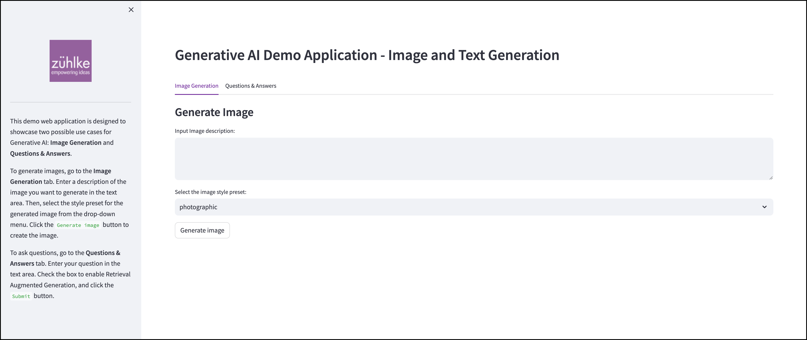

# Introduction to the demo Generative AI application

The demo Generative AI application used in this workshop is a simple web application that utilizes LLMs to generate text and images based on user input.

The front-end component of the application is built is built using [Streamlit](https://streamlit.io/), a Python library for building web applications, and will be deployed to an Amazon Elastic Container Service (ECS) cluster. The back-end components, which are responsible for responding to user prompts, will be deployed as AWS Lambda functions and Amazon API Gateways. There are also other services such as Amazon S3, Amazon OpenSearch Service, and Amazon SageMaker, which are provisioned to enable the LLM fine-tuning process and retrieval augmented generation (RAG) feature.

Below diagram shows the complete architecture of the demo application.

In the first part of the workshop, we will focus on deploying this application to AWS. We will write its infrastructure as code (IaC) and build a CI/CD pipeline to deploy the application in a fully automated manner.

In the second part of the workshop, we will evolve this application by implementing a continuous fine-tuning process and retrieval augmented generation (RAG) features, with the aim of improving the quality of the generated outputs.

# Next steps

Navigate to [Before you begin](/10-before-you-begin.md) to start preparation.
