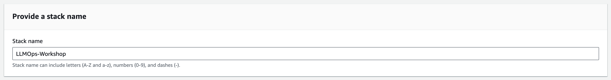
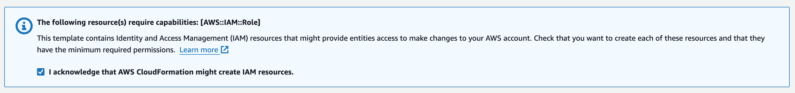

# Getting started

First, you will need to prepare your development environment and deploy the necessary AWS resources which will be utilized later in the workshop.

# Prepare your development environment

This version of the workshop is tested to work with Python 3.11, AWS CDK 2.128.0, and AWS CLI 2.15.21. To have a smooth experience, ensure that you have the correct versions of the dependencies installed on your local machine.

> __Note:__ It's recommended that participants attempt this workshop in a development container, or GitHub Codespaces, using the provided configuration. 
> Follow these links to learn more about [Development Container](https://containers.dev/), [GitHub Codespaces](https://github.com/features/codespaces) and [Developing inside a container with Visual Studio Code](https://code.visualstudio.com/docs/devcontainers/containers).
>
> __Skip this step if you are using GitHub Codespaces or a development container.__

1. Ensure that you have the necessary dependencies installed on your local machine:
    - Docker
    - Python 3.11
    - Npm
    - AWS CDK 2.128.0
    - AWS CLI 2.15.21

2. In the root folder of the workshop repository, manually create and activate a Python virtual environment:

```shell
python3 -m venv .venv
source .venv/bin/activate
```

3. Once the virtualenv is activated, you can install the required dependencies.

```shell
pip install -r requirements.txt
```


# Configure your AWS credentials

Make sure you have your AWS credentials properly configured in your terminal.

If you have an  AWS access key, export it as environment variables by running the following commands in your terminal.

```shell
export AWS_ACCESS_KEY_ID=your_access_key
export AWS_SECRET_ACCESS_KEY=your_secret_key
```

### Deploy necessary AWS resouces

Deploy the `LLMOps-Workshop` Cloudformation Stack into your AWS account. This CloudFormation stack will deploy the necessary AWS resources for the workshop. These resources include a SageMaker Domain, an OpenSearch cluster, IAM roles, and more.

> Reminder: We'll use `us-east-1` as the AWS region for this workshop. Make sure you have set the correct region in the AWS Management Console or in your AWS CLI configuration.

Click below link to launch the `LLMOps-Workshop` CloudFormation stack into the corresponding AWS Region.

Region|Launch URL
:--|:--
us-east-1|[Launch](https://console.aws.amazon.com/cloudformation/home?region=us-east-1#/stacks/new?stackName=LLMOps-Workshop&templateURL=https://raw.githubusercontent.com/trankimtung/aws-llmops-workshop/main/getting-started.yml)

Specify an unique stack name, or stick with the default option of `LLMOps-Workshop`. Keep all other settings in the `Specify stack details` section at their default values.



Tick the box to acknowledge that CloudFormation may generate IAM resources in your account, then click `Submit`.



Alternatively, you can run the following command in your terminal. Before executing this command, ensure your AWS credentials are properly configured.

```shell
aws cloudformation create-stack --stack-name LLMOps-Workshop --capabilities CAPABILITY_IAM --template-body file://getting-started.yml
```

> The deployment will take about 20 minutes to complete. You can monitor the progress under the `Events` tab within your CloudFormation Stack.

Once the status changes to `CREATE_COMPLETE`, you'll know that the stack has been successfully launched.


# Next steps

[Click here to proceed to the next chapter](/part-01/10-introduction-to-the-demo-application.md)
