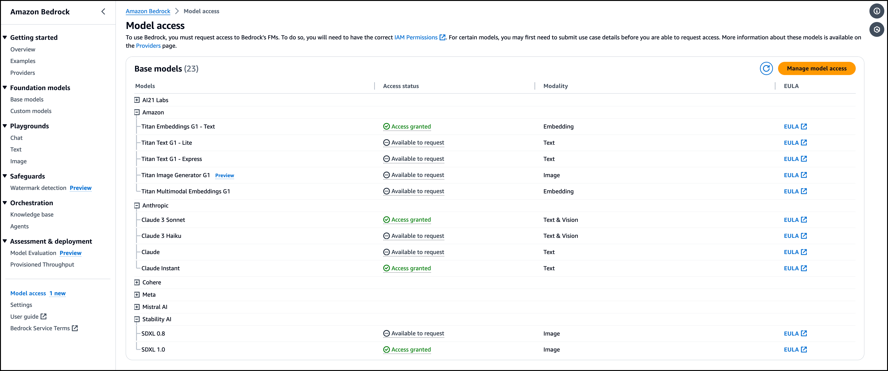

# Before you begin

To ensure that you have access to all the necessary tools and AWS resources to complete this workshop, follow the steps below.

> We will use `us-east-1` as the AWS region for this workshop.   
> Make sure you have set the correct region in the AWS Management Console or in your terminal.

# Request access to Amazon Bedrock foundation models

1. Open the [AWS Management Console](https://console.aws.amazon.com/), search for `Amazon Bedrock`. Using the left-hand navigation panel, scroll down to select `Model Access`.
2. In the `Model access` panel, click the `Manage model access` button, in the top right-hand corner.
3. Select the check-box for __Anthropic__, and click the `Submit use case details` button. Fill out the use case form.
4. Click the `Submit` button.
5. Check the boxes for these models:
   - `Claude Instant`
   - `Claude Sonnet`
   - `SDXL 1.0`
   - `Titan Embeddings G1 - Text`
6. Click the `Save changes` button to submit the access request.

> The approval process should take approximately 5 minutes to complete. You will receive email notifications once the request is approved.

After the access is granted, you will have access to the foundation models. Your `Model access` panel should look like this:



# Request service quota increase for AWS CodeBuild

For new AWS accounts, the default service quotas for AWS CodeBuild may not be sufficient to run this workshop. In particular, the `maximum number of concurrently running builds` for Linux/Small and Linux/Medium environments may need to be increased.

Follow the steps below in AWS Console to request a service quota increase for AWS CodeBuild. If your account already has a sufficient service quota (more than 5), you can skip this section.

1. Open the [AWS Management Console](https://console.aws.amazon.com/).
2. In the search bar, type `Service Quotas` and select the service.
3. In the left-hand navigation pane, select `AWS services`.
4. In the `Service Quotas` dashboard, search and select `AWS CodeBuild` from the list of services.
5. In the `AWS CodeBuild` dashboard, search and select `Concurrently running builds for Linux/Small environment`.
6. Click the `Request increase at account level` button.
7. Set the `Increase quota value` to `5`.
8. Review the request and click the `Request` button.
9. Repeat steps 5-8 for `Concurrently running builds for Linux/Medium environment`.


Alternatively, you can execute the following commands:

```shell
# Maximum number of concurrently running builds for Linux/Small environment
aws service-quotas request-service-quota-increase --service-code codebuild --quota-code L-9D07B6EF --desired-value 5

# Maximum number of concurrently running builds for Linux/Medium environment
aws service-quotas request-service-quota-increase --service-code codebuild --quota-code L-2DC20C30 --desired-value 5
```

# Request service quota increase for AWS SageMaker

For new AWS accounts, the default service quotas for AWS SageMaker may not be sufficient to run this workshop.

Follow the steps below in AWS Console to request a service quota increase for AWS SageMaker. If your account already has a sufficient service quota (more than 1), you can skip this section.

1. Open the [AWS Management Console](https://console.aws.amazon.com/).
2. In the search bar, type `Service Quotas` and select the service.
3. In the left-hand navigation pane, select `AWS services`.
4. In the `Service Quotas` dashboard, search and select `AWS SageMaker` from the list of services.
5. In the `AWS SageMaker` dashboard, search and select `ml.m5.xlarge for processing job usage`.
6. Click the `Request increase at account level` button.
7. Set the `Increase quota value` to `1`.
8. Review the request and click the `Request` button.
9. Repeat steps 5-8 for `ml.m5.xlarge for training job usage`.


Alternatively, you can execute the following commands:

```shell
# ml.m5.xlarge for processing job usage
aws service-quotas request-service-quota-increase --service-code sagemaker --quota-code L-0307F515 --desired-value 1

# ml.m5.xlarge for training job usage
aws service-quotas request-service-quota-increase --service-code sagemaker --quota-code L-CCE2AFA6 --desired-value 1
```

# Get familiar with GitHub Codespaces

It's recommended that you attempt this workshop in a [development container](https://containers.dev/), or [GitHub Codespaces](https://github.com/features/codespaces), using the provided configuration. By doing so, you avoid the hassle of setting up your local development environment and ensure that all the necessary tools and dependencies are readily available.  

Follow this guide to [start using GitHub Codespaces](https://docs.github.com/en/codespaces/getting-started/quickstart). Or check out how to [Develop inside a container with Visual Studio Code](https://code.visualstudio.com/docs/devcontainers/containers).

# Next steps

Navigate to [Getting started](/20-getting-started.md) to start the workshop.
