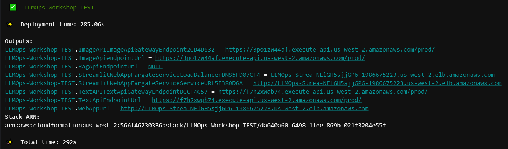

# Deploying to AWS with the AWS Cloud Development Kit

In this chapter, you will use the infrastructure code you've written to deploy the demo application to AWS with the AWS Cloud Development Kit (CDK). By doing so, you'll be able to confirm that the infrastructure is deployable and the demo Generative AI application is functional. You'll also observe how AWS CDK interacts with AWS CloudFormation to deploy the infrastructure.

# Steps

Follow the steps below to deploy the infrastructure and the demo Generative AI application to AWS.

## Add the `InfrastructureStack` to the `app.py` file

> The `app.py` file is the top-level grouping of all the infrastructure components. This is the main file which AWS CDK will interact with to understand and deploy the application, and is found in the root of the workshop repository folder.

1. Add the `InfrastructureStack` created in the previous chapter. This stack is utilized for standalone development and testing of the Generative AI Application, without relying on a CICD pipeline. Below the `InfrastructureStack`, you'll find the `ToolChainStack` section, where you'll place the code defining the CICD pipeline, which will be constructed later in the workshop. 

Copy the following code and paste it into the appropriate section under `# Create the infrastructure to be used for stand-alone TEST of the generative AI application`:

```python
InfrastructureStack(
    app,
    f"{constants.WORKLOAD_NAME}-TEST",
    env=cdk.Environment(
        account=boto3.client("sts").get_caller_identity().get("Account"),
        region=constants.REGION
    )
)
```

2. Make sure to save the `app.py` file.

## Bootstrap the AWS environment for AWS CDK

Now that you have the CDK stack ready for deployment, you'll need to ensure that the AWS environment (AWS account and region) you're deploying to has the necessary resources for AWS CDK to operate. This is achieved through bootstrapping.

During bootstrapping, AWS CDK will create several resources in your environment to facilitate its operation. These resources typically include an Amazon S3 Bucket, an AWS Key Management Service (KMS) Key, Amazon Identity and Access Management (IAM) Roles, an Amazon Elastic Container Registry (ECR) repository, and an Amazon Systems Manager (SSM) parameter for versioning.

To start bootstrapping, use the CDK bootstrap command:

> Reminder: Before you proceed, ensure that you have configure your AWS credentials properly in your terminal.


```shell
export AWS_ACCOUNT_ID=$(aws sts get-caller-identity --query Account --output text)
export AWS_DEFAULT_REGION=us-east-1
export AWS_REGION=us-east-1
cdk bootstrap aws://$AWS_ACCOUNT_ID/$AWS_REGION --cloudformation-execution-policies arn:aws:iam::aws:policy/AdministratorAccess
```

> Note: CDK bootstrapping should take approximately 2 minutes to complete. You only need to perform this step once per AWS account and region.

With the AWS environment bootstrapped, you're now ready to deploy the demo application.

## Synthesize the CloudFormation template

Before deploying, you can perform an unit test of your infrastructure code by synthesizing the CloudFormation template. 

Synthesizing the CloudFormation template is the process of transforming the AWS CDK code (written in Python in this case) into a CloudFormation template and deployable application assets. This process is similar to compiling code in a programming language.

In your terminal, run:

```shell
cdk synth
```

A successful synthesis means that the CloudFormation template (which is created behind the scenes using the CDK) is deployable and all application assets are successfully created. If the synthesis succeeds, the CloudFormation template and application assets are located in a folder called `cdk.out` within your workshop folder. The CloudFormation template file name ends in `.template.json`.

If you do not encounter any errors, proceed to the next step.

## Deploy to AWS

Now you will deploy the infrastructure and the demo Generative AI application to AWS.

In your terminal, run:

```shell
cdk deploy --require-approval never
```

During the deployment, AWS CDK will upload the application assets to AWS and interact with AWS CloudFormation to provision the infrastructure components. This process should take approximately 10 minutes to complete.

When the deployment completes, your output should look like this:



Follow the URL of `WebAppUrl` output to access the demo Generative AI application.

## Delete the test stack

Now that you've confirmed the infrastructure and the demo Generative AI application are functional, you can delete the test stack.

In your terminal, run:

```shell
cdk destroy
```

# Next steps

[Click here to proceed to the next chapter](/part-01/40-building-a-cicd-pipeline.md)