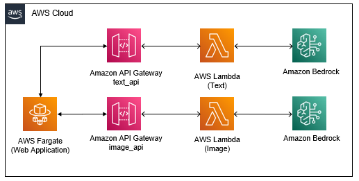
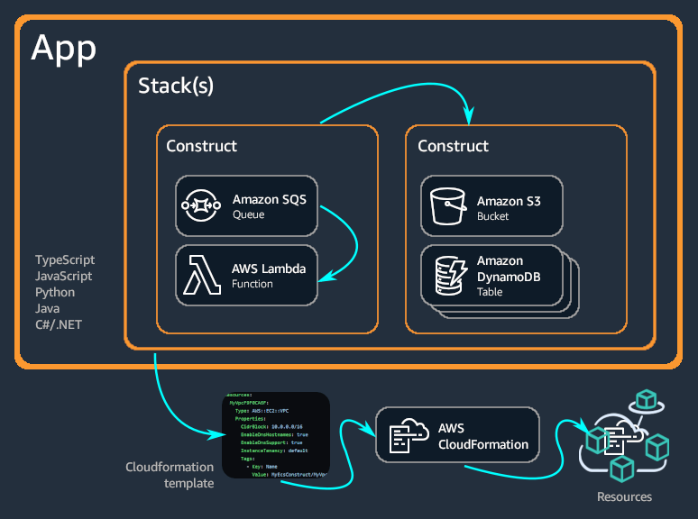
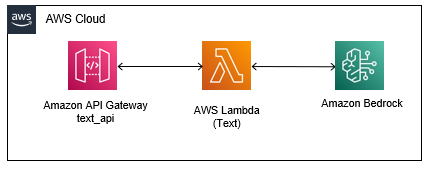
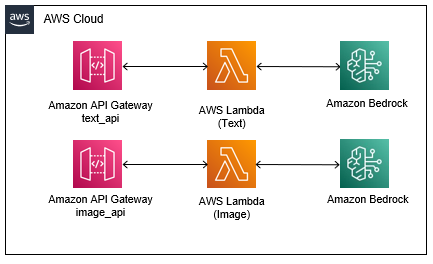
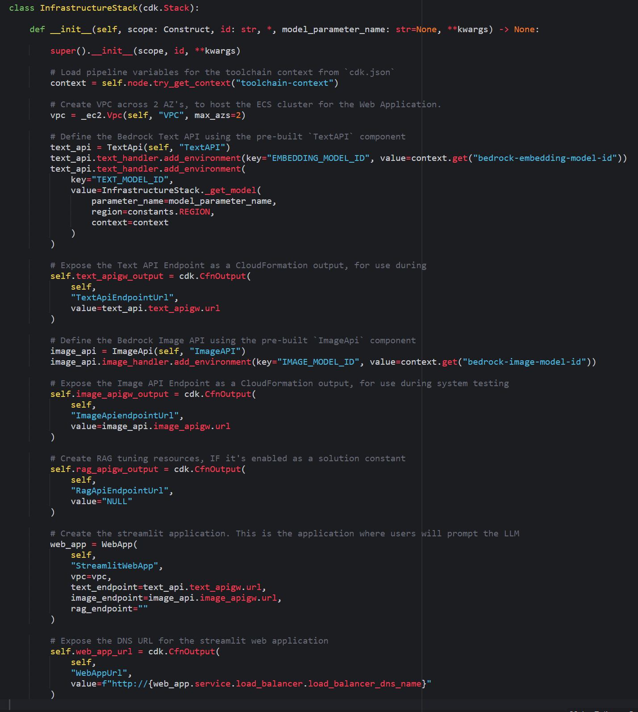

# Writing Infrastructure as Code with AWS Cloud Development Kit

In this chapter, you will create the infrastructure for the demo Generative AI application. You will not interact with the AWS Management Console to configure the services. Instead, you will use the AWS Cloud Development Kit (CDK) to define the infrastructure as code. 

The infrastructure for the demo application includes the following components: 
- A Virtual Private Cloud (VPC) to host the ECS Fargate Cluster
- Amazon API Gateways to host the Text and Image APIs
- AWS Lambda functions to handle the API requests
- An Amazon OpenSearch Domain to host the Retrieval Augmented Generation (RAG) database (optional)
- An Amazon ECS Fargate Cluster to host the web application

Below diagram shows what the architecture looks like:




# Introduction to Infrastructure as Code

__Infrastructure as Code (IaC)__ is an approach to managing and provisioning computing infrastructure (such as servers, networks, and databases) through machine-readable definition files, rather than through manual configuration or interactive tools. With Infrastructure as Code, infrastructure configurations are expressed as code, typically using programming languages or configuration files. This code can then be version-controlled, tested, and automated to ensure consistent and reproducible deployments across different environments, such as development, testing, and production.

Infrastructure as Code offers several benefits over traditional manual infrastructure management approaches, including:

- __Consistency__: IaC ensures that infrastructure configurations remain uniform across different environments, reducing the risk of configuration errors or discrepancies.
- __Reproducibility__: Infrastructure setups can be reliably replicated by using code, facilitating consistent deployment and environment recreation. This capability is particularly useful for testing, debugging, and disaster recovery scenarios.
- __Scalability__: IaC allows for easy scaling of resources up or down based on demand. Automated provisioning enables quick adjustments to accommodate changes in workload or user traffic.
- __Efficiency__: By automating infrastructure provisioning and management tasks, IaC reduces the need for manual intervention. This automation streamlines deployment processes, saves time, and minimizes the potential for human error.
- __Collaboration__: Infrastructure configurations stored as code can be easily shared and collaborated on within teams. Version control systems enable multiple developers to work on infrastructure setups simultaneously, promoting teamwork and knowledge sharing.
- __Documentation__: Infrastructure code serves as documentation of the system architecture and configuration. It provides insights into how the infrastructure is provisioned and configured, enhancing transparency and facilitating troubleshooting and auditing processes.

Overall, Infrastructure as Code improves consistency, reliability, scalability, efficiency, collaboration, and documentation in managing and provisioning computing infrastructure.

# Introduction to the AWS Cloud Development Kit

There are several tools and frameworks available for implementing Infrastructure as Code, including AWS CloudFormation, Terraform, Pulumi, and AWS Cloud Development Kit (CDK). In this workshop, you will use the AWS Cloud Development Kit (CDK) and the Python programming language to define and provision the infrastructure for the Generative AI application.

The AWS Cloud Development Kit (AWS CDK) is an open-source software development framework for defining cloud infrastructure in code and provisioning it through AWS CloudFormation. It consists of two primary parts:

- __AWS CDK Construct Library__: A collection of pre-written modular and reusable pieces of code, called constructs, that you can use, modify, and integrate to develop your infrastructure quickly. The goal of the AWS CDK Construct Library is to reduce the complexity required to define and integrate AWS services together when building applications on AWS.
- __AWS CDK Toolkit__: A command line tool for interacting with CDK apps. Use the AWS CDK Toolkit to create, manage, and deploy your AWS CDK projects.

The AWS CDK supports TypeScript, JavaScript, Python, Java, C#/.Net, and Go. You can use any of these supported programming languages to define reusable cloud components known as constructs. You compose these together into stacks and apps. Then, you deploy your CDK applications to AWS CloudFormation to provision or update your resources.



Learn more about AWS Cloud Development Kit [here](https://docs.aws.amazon.com/cdk/v2/guide/home.html).

# Steps

Follow the steps below to define the infrastructure for the demo application.

## Create the `InfrastructureStack`

1. Open the `stacks/infrastructure.py` file. 

2. For each of the following sections, copy the code into the corresponding section within the `infrastructure.py` file.

Retrieve the toolchain context. This context, defined in the `cdk.json` file, contains essential configurations such as the foundation models to utilize, the hyper parameters of the fine-tuning job.

```python
        context = self.node.try_get_context("toolchain-context")
```

Define the VPC which will host the ECS Fargate Cluster.

```python
        vpc = _ec2.Vpc(self, "VPC", max_azs=2)
```

Instantiate the Text API by employing the pre-defined `TextAPI` component. When accessing the `Text Generation` tab of the demo web application, you'll notice that this component serves as the API responsible for receiving and responding to your prompt requests for text generation. The Lambda function associated with this API formats the text generation request within a prompt template, forwards the prompt to a LLM model, which in this instance is facilitated by Amazon Bedrock.

```python
        text_api = TextApi(self, "TextAPI")
        text_api.text_handler.add_environment(key="EMBEDDING_MODEL_ID", value=context.get("bedrock-embedding-model-id"))
        text_api.text_handler.add_environment(
            key="TEXT_MODEL_ID",
            value=InfrastructureStack._get_model(
                parameter_name=model_parameter_name,
                region=constants.REGION,
                context=context
            )
        )
```
Here is what the `TextAPI` component looks like:



Next, you will save the Text API URL as a CloudFormation Output parameter. This parameter will be leveraged by the CICD pipeline to automate the system test.

```python
        self.text_apigw_output = cdk.CfnOutput(
            self,
            "TextApiEndpointUrl",
            value=text_api.text_apigw.url
        )
```

Next, you'll create the Image API along with its supporting Lambda function by utilizing the pre-defined `ImageAPI` component. Upon accessing the `Image Generation` tab of the generative AI web application, you'll observe that this component operates similarly to the `TextAPI` component. The API will receive your prompt for generating an image, format it within the prompt template, and then forward the prompt to the LLM model hosted by Amazon Bedrock.

```python
        image_api = ImageApi(self, "ImageAPI")
        image_api.image_handler.add_environment(key="IMAGE_MODEL_ID", value=context.get("bedrock-image-model-id"))
```

Here is what the architecture looks like after `TextAPI` and `ImageAPI` are added:



Once again, you save the Image API URL as a Cloudformation Output parameter for later use during system testing.

```python
        self.image_apigw_output = cdk.CfnOutput(
            self,
            "ImageApiendpointUrl",
            value=image_api.image_apigw.url
        )
```

The demo application is expecting a retrieval augmented generation API (RAG API). Since the RAG API is not yet integrated into the application architecture and will be added later in the workshop, you should set its value as `NULL` for the time being. This measure ensures that the system test does not encounter failures.

```python
        self.rag_apigw_output = cdk.CfnOutput(
            self,
            "RagApiEndpointUrl",
            value="NULL"
        )
```

> You'll notice that the comment mentions the `ENABLE_RAG` constant variable in `constants.py`. By default this constant is set to `False` so you do not need to change it at this point.

Next, you will define the web application, which serves as the interface for sending prompts to the models and receiving responses. This application is built using [Streamlit](https://streamlit.io/), an open-source Python library that simplifies the creation of custom web apps for machine learning and data science. This component establishes an ECS Fargate cluster to host the application. The specified parameters dictate the hosting location of the application and the URLs of the backend APIs that the application should utilize.

```python
        web_app = WebApp(
            self,
            "StreamlitWebApp",
            vpc=vpc,
            text_endpoint=text_api.text_apigw.url,
            image_endpoint=image_api.image_apigw.url,
            rag_endpoint=""
        )
```

Below diagram shows the components you have created until this point:


Lastly, you'll save the DNS URL of the web application as a CloudFormation Output parameter. This enables convenient access to the application after deployment.

```python
        self.web_app_url = cdk.CfnOutput(
            self,
            "WebAppUrl",
            value=f"http://{web_app.service.load_balancer.load_balancer_dns_name}"
        )
```

3. Make sure that you save the `infrastructure.py` file. After all additions, the `InfrastructureStack` class should look like this:



# Next steps

Navigate to [Deploying to AWS](/part-01/40-deploying-to-aws.md) to start deploying the infrastructure to AWS.