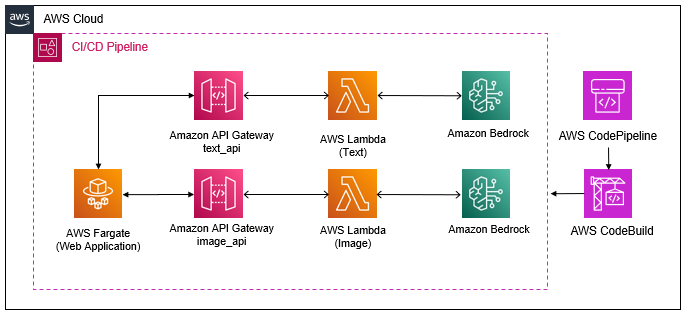

# Building a Continuous Integration and Continuous Deployment Pipeline

In the previous chapter  you have observed how AWS CDK works, manually deployed both the infrastructure code and the demo application to a test environment and verified that they are working as expected. Now you will build a Continuous Integration and Continuous Deployment (CI/CD) pipeline to automate that process, targeting a QA and a Production environment.

This diagram shows what the architecture looks like after a CI/CD pipeline, backed by AWS CodePipeline, is added:



Below diagram shows the design of the CI/CD pipeline, breaking down the different stages and actions that are executed:


Any modifications made to the `InfrastructureStack`, once committed to the CodeCommit repository, will be deployed across all environments, upon the successful completion of the automated system tests for each environment.


# Introduction to Continuous Integration and Continuous Deployment

__Continuous Integration and Continuous Deployment (or Delivery) (CI/CD)__ is an essential part of DevOps and any modern software development practice. It combines the practices of continuous integration and continuous deployment (or delivery). CI/CD automates much or all of the manual human intervention traditionally needed to get new code from a commit into production, encompassing the build, test (including integration tests, unit tests, and regression tests), and deploy phases, as well as infrastructure provisioning. With a CI/CD pipeline, development teams can make changes to code that are then automatically tested and pushed out for delivery and deployment.


The benefits of CI/CD include:

1. **Faster Time to Market**: CI/CD automates various stages of the software development pipeline, enabling faster and more frequent releases. This rapid delivery cycle helps organizations respond quickly to market changes and customer feedback, ultimately reducing time-to-market for new features and updates.
2. **Improved Code Quality**: Continuous Integration ensures that code changes are regularly integrated into the main codebase and tested automatically. This early detection of bugs and integration errors helps maintain code quality and stability by identifying issues sooner in the development process.
3. **Reduced Manual Errors**: Automation of repetitive tasks such as building, testing, and deployment reduces the potential for human error. CI/CD pipelines enforce consistent processes and configurations, minimizing the risk of deployment failures and production incidents caused by manual mistakes.
4. **Increased Collaboration**: CI/CD encourages collaboration among developers, testers, and operations teams by providing a shared platform for code integration, testing, and deployment. Transparent processes and automated feedback loops facilitate communication and cooperation across different roles within the organization.
5. **Enhanced Feedback Loop**: Automated testing and deployment in CI/CD pipelines provide rapid feedback to developers about the quality and functionality of their code changes. This immediate feedback loop enables developers to address issues promptly, iterate on their code, and deliver higher-quality software more efficiently.
6. **Scalability and Flexibility**: CI/CD pipelines are scalable and adaptable to various project sizes and development environments. They can accommodate changes in project requirements, technology stacks, and team sizes, making them suitable for both small startups and large enterprises.
7. **Risk Mitigation**: By automating testing and deployment processes, CI/CD pipelines reduce the risk associated with manual interventions and deployment errors. Continuous monitoring and rollback mechanisms help mitigate the impact of failed deployments and ensure system stability and reliability.

Overall, CI/CD enables organizations to deliver software faster, with higher quality, and with reduced risk, leading to improved customer satisfaction, competitive advantage, and business agility.

# Steps

Follow the steps below to create a CI/CD pipeline for the demo Generative AI application:

## Create the `ToolChainStack`

1. Open the `stacks/toolchain.py` file.

2. For each of the following sections, copy the code into the corresponding section of the `toolchain.py` file

Retrieve the toolchain context. This context, defined in the `cdk.json` file, contains essential configurations such as the foundation models to utilize, the hyper parameters of the fine-tuning job.

```python
        context = self.node.try_get_context("toolchain-context")
```

Create a CodeCommit repository to store the application source code. In addition to creating the repository, you also define the repository as the source for the CodePipeline.

```python
        source_repo = _codecommit.Repository(
            self,
            "SourceRepository",
            repository_name=constants.WORKLOAD_NAME.lower(),
            description=f"Source Code repository for {constants.WORKLOAD_NAME}"    
        )
        source = _pipelines.CodePipelineSource.code_commit(
            repository=source_repo,
            branch="main"
        )
        cdk.CfnOutput(
            self,
            "SourceCodeUrl",
            value=source_repo.repository_clone_url_http
        )
```

Create a `CustomModelName` parameter to store the name of a fine-tuned large language model. The value of this parameter will determine which model the demo application will use. For now the parameter value will be set to `PLACEHOLDER`, we will revisit this parameter in later part of the workshop.

```python
        model_parameter = _ssm.StringParameter(
            self,
            "CustomModelParameter",
            description="Custom Model Name",
            parameter_name="CustomModelName",
            string_value="PLACEHOLDER"
        )
```

Now you will start defining the CI/CD pipeline. This block defines what actions will occur during the pipeline `Build` phase.

```python
        pipeline = _pipelines.CodePipeline(
            self,
            "CDKPipeline",
            pipeline_name=f"{constants.WORKLOAD_NAME}-Pipeline",
            self_mutation=True,
            cli_version=context.get("cdk-version"),
            cross_account_keys=True,
            publish_assets_in_parallel=False,
            synth=_pipelines.CodeBuildStep(
                "Synth",
                input=source,
                role=_iam.Role(
                    self,
                    "SynthRole",
                    assumed_by=_iam.CompositePrincipal(
                        _iam.ServicePrincipal("codebuild.amazonaws.com"),
                    ), 
                    managed_policies=[
                        _iam.ManagedPolicy.from_aws_managed_policy_name("AdministratorAccess")
                    ]
                ),
                install_commands=[
                    "printenv",
                    f"npm install -g aws-cdk@{context.get('cdk-version')}",
                    "python -m pip install -U pip",
                    "pip install -r requirements.txt",
                ],
                commands=[
                    "cdk synth"
                ]
            ),
            docker_enabled_for_synth=True
        )
```

Use the `_add_stage()` method to add the QA stage to the pipeline. This stage is responsible for deploying the application to the QA environment. This stage will also include a `System Test` action to verify the application's functionality.

```shell
        ToolChainStack._add_stage(
            pipeline=pipeline,
            stage_name=constants.QA_ENV_NAME,
            stage_account=self.account,
            stage_region=self.region,
            model_parameter_name="CustomModelName"
        )
```

Use the `_add_stage()` method to add the Production stage to the pipeline

```python
        ToolChainStack._add_stage(
            pipeline=pipeline,
            stage_name=constants.PROD_ENV_NAME,
            stage_account=self.account,
            stage_region=self.region,
            model_parameter_name="CustomModelName"
        )
```

> Creating separated QA and Production environments adheres to DevOps best practices by allowing changes to the infrastructure and application code to be tested in a distinct environment prior to releasing to production. Automated system tests are executed in the QA environment. If the tests fail, the pipeline stops. If the tests pass, the changes are deployed to the production environment.

Leave the Continuous Tuning stage blank. You will add this stage in later part of the workshop.

3. Make sure to save the `toolchain.py` file.

After all additions, your `ToolChainStack` class should look like:


## Add the `ToolChainStack` to `app.py`

1. Open the `app.py` file.
   
2. Comment out the code associated with the test `InfrastructureStack`, as you will now deploy the CI/CD pipeline instead of the test environment.
   
3. Paste in the code below so that the CDK will deploy the new `ToolChainStack`.

```python
        ToolChainStack(
            app,
            f"{constants.WORKLOAD_NAME}-Toolchain",
            env=cdk.Environment(
                account=boto3.client("sts").get_caller_identity().get("Account"),
                region=constants.REGION
            )
        )
```

4. Save the `app.py` file.

Your `app.py` file should now look like this:


## Deploy the pipeline

In your terminal, run:

```shell
cdk deploy --require-approval never --verbose
```

> Note: Deployment will take about 5 minutes to complete.

You should see the following output upon a successful deployment of the CI/CD pipeline:


## Execute the CI/CD pipeline

1. In the AWS Management Console, navigate to the `CodePipeline` service. You'll observe that the most recent execution has failed. This is expected since no code has been committed to the CodeCommit Repository yet.
   
2. In the AWS Management Console, locate and click on the CodeCommit service. You'll observe that the repository defined in the `toolchain.py` file is indeed empty.

3. Run the following commands to push the source code to the new CodeCommit repository.

```shell
git add -A
git commit -m "ci: setup cicd pipeline"
pip install git-remote-codecommit
git remote add ccm codecommit::us-east-1://llmops-workshop
git push ccm main
```

4. Using the AWS Management Console, refresh the CodeCommit Repository page. You'll now see that the repository is populated with the source code. With the code now stored in a repository and integrated into a CI/CD Pipeline, any modifications will initiate a pipeline execution.

5. In the AWS console, search for, and click on the `CodePipeline` service. Notice that now instead of `Failed`, the most recent execution is `In progress`. The code pipeline is now able to execute the stages you built in the `toolchain.py` file. When any modifications are made to the source code, regardless of whether to the components, infrastructure stack, toolchain stack, or other files, the toolchain is automatically updated and the pipeline is re-executed. At each stage, the pipeline checks to see if the changes affecting the current stage, and if it does, automatically makes the necessary changes. This is the self-mutating piece of the pipeline. You can now see a visual of the QA and Prod stages that you added to the pipeline.

6. Wait for the pipeline to complete.

> Note: The CI/CD pipeline execution should take approximately 20 minutes to complete.

## Explore the QA and Production environments

1. After the pipeline completes, use the AWS Management Console to search for and access the CloudFormation service. Select the `QA` stack and navigate to the Outputs tab.

2. Click on the URL value associated with `WebAppUrl`.

3. Repeat steps 1 and 2 for the Production environment.

4. You can also click on the `View logs` link for the `SystemTests` action within the QA stage. This will display the results of the automated system test that need to pass before production deployment starts.

# Next steps

Navigate to [Evolving Generative AI applications](/part-02/) to start part 2 of the workshop.