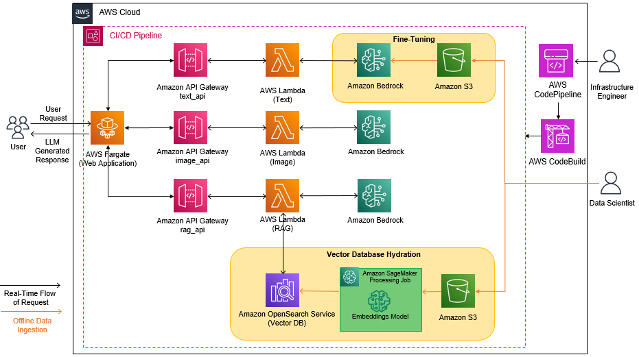
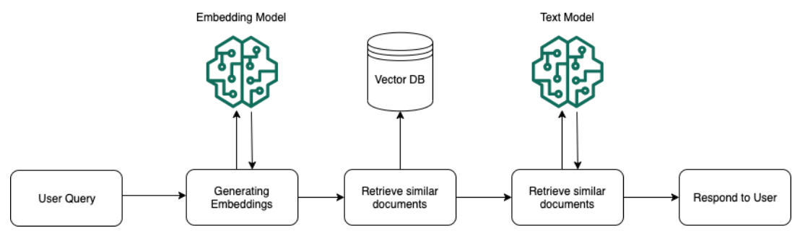
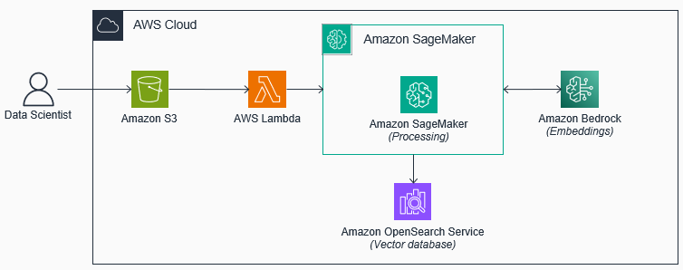
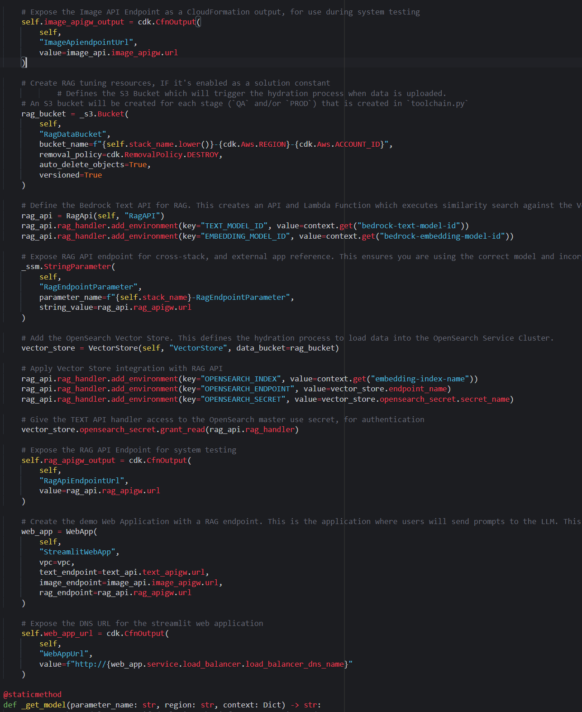

# Retrieval Augmented Generation

In this chapter, you will learn how to implement Retrieval Augmented Generation (RAG) for the demo Generative AI application. 

You will update the `InfrastructureStack` to include the necessary components to support RAG. Those components include an S3 bucket, an OpenSearch Service Domain, and a Lambda Function. You will then take a text file, break it into composable chunks, capture the vectorized representation of each chunk using an embedding model, and then hydrate the Amazon OpenSearch Service database index with these embeddings. Finally, you will observe how the model can leverage this enriched dataset to provide more accurate responses to queries related to the topic.

By the end of this section, your architecture will look as follows:



# Introduction to Retrieval Augmented Generation (RAG)

__Retrieval Augmented Generation (RAG)__ is an LLM grounding technique that is used to provide additional context to LLMs, such as documents and domain specific data. To enable RAG, the documents/data and their embeddings are stored in a Vector Database. When a prompt is submitted to the model, a similarity search is performed on the Vector Database to identify relevant information to include in the prompt. The prompt, query context, and retrieved information from the Vector Database are then used as inputs to the LLM, resulting in an "augmented" output that incorporates the retrieved information.



RAG holds significant appeal for organizations concerned with safeguarding the intellectual property and security of their domain data. Through RAG, it's possible to provide secure and governed access to foundation models without directly integrating the data into the model through processes like re-training or fine-tuning. This approach enables organizations to maintain control over sensitive data while still benefiting from the enhanced capabilities provided by foundation models.

Just as Continuous Tuning can be automated within the LLMOps process, we can also integrate Retrieval Augmented Generation (RAG) to ensure that the foundation model remains current and up-to-date with the latest data and information. LLMOps enables continuous preprocessing of documents and data, which includes tasks such as chunking text, computing embeddings, and storing the information in Vector Databases. As additional information is incorporated into the Vector Database, the model becomes better equipped to offer accurate responses.

The process is illustrated below:




# Steps

Follow the steps below to implement RAG for the demo Generative AI application:

## Configure the application to use a foundation model

In the previous chapter, the application was configured to use a fine-tuned model. Since RAG is an alternate methodology to fine-tuning, we will reset the application to use a foundation model. To do this, you will update the AWS Systems Manager Parameter Store `CustomModelName` parameter value to `PLACEHOLDER`.

Follow the steps below to update the model configuration:

1. In your terminal, run the AWS CLI command to update the AWS Systems Manager Parameter Store parameter value to `PLACEHOLDER`.

```shell
aws ssm put-parameter --name CustomModelName --value PLACEHOLDER --overwrite
```

2. Verify the parameter is set to `PLACEHOLDER`, by running the following CLI command:

```shell
aws ssm get-parameter --name CustomModelName --query "Parameter.Value"
```

> Note: The foundation model used by the application is defined in the `cdk.json` file in the root of the workshop repository.


## Update `constants.py` file to enable RAG

1. Open the `constants.py` file in the root folder of the workshop repository.

2. Set `ENABLE_RAG` equal to `True`, and save the file.

3. In the AWS Console, navigate to `CloudFormation` service.

4. Click on the getting started stack `LLMOps-Workshop` created at the beginning of the workshop.

5. Select the Outputs tab and note down the values for both the `OpenSearchDomainEndpoint`, and `OpenSearchSecret` parameters.

6. In the `constants.py` file, set the `OPENSEARCH_ENDPOINT` parameter to be equal to the `OpenSearchDomainEndpoint` value, and set `OPENSEARCH_SECRET_ARN` equal to the `OpenSearchSecret` value.

7. Save the `constant.py` file.


## Update the `InfrastructureStack`

1. Open `stacks/infrastructure.py`.

2. Replace the code immediately under `Create RAG tuning resource, IF it's enabled as a solution constant` with the following:

```python
        # Defines the S3 Bucket which will trigger the hydration process when data is uploaded.
        # An S3 bucket will be created for each stage (`QA` and/or `PROD`) that is created in `toolchain.py`
        rag_bucket = _s3.Bucket(
            self,
            "RagDataBucket",
            bucket_name=f"{self.stack_name.lower()}-rag-{cdk.Aws.REGION}-{cdk.Aws.ACCOUNT_ID}",
            removal_policy=cdk.RemovalPolicy.DESTROY,
            auto_delete_objects=True,
            versioned=True
        )

        # Define the Bedrock Text API for RAG. This creates an API and Lambda Function which executes similarity search against the Vector Database before prompting the model in Bedrock
        rag_api = RagApi(self, "RagAPI")
        rag_api.rag_handler.add_environment(key="TEXT_MODEL_ID", value=context.get("bedrock-text-model-id"))
        rag_api.rag_handler.add_environment(key="EMBEDDING_MODEL_ID", value=context.get("bedrock-embedding-model-id"))

        # Add the OpenSearch Vector Store. This defines the hydration process to load data into the OpenSearch Service Cluster.
        vector_store = VectorStore(self, "VectorStore", data_bucket=rag_bucket)

        # Apply Vector Store integration with RAG API
        rag_api.rag_handler.add_environment(key="OPENSEARCH_INDEX", value=context.get("embedding-index-name"))
        rag_api.rag_handler.add_environment(key="OPENSEARCH_ENDPOINT", value=vector_store.endpoint_name)
        rag_api.rag_handler.add_environment(key="OPENSEARCH_SECRET", value=vector_store.opensearch_secret.secret_name)

        # Give the TEXT API handler access to the OpenSearch master use secret, for authentication
        vector_store.opensearch_secret.grant_read(rag_api.rag_handler)

        # Expose the RAG API Endpoint for system testing
        self.rag_apigw_output = cdk.CfnOutput(
            self,
            "RagApiEndpointUrl",
            value=rag_api.rag_apigw.url
        )
```

4. Replace the code under the comment `Create the streamlit application. This is the application where users will prompt the LLM` with the following code. You may notice that the only difference is the value of the `rag_endpoint` parameter:

```python
        # Create the streamlit application. This is the application where users will prompt the LLM
        web_app = WebApp(
            self,
            "StreamlitWebApp",
            vpc=vpc,
            text_endpoint=text_api.text_apigw.url,
            image_endpoint=image_api.image_apigw.url,
            rag_endpoint=rag_api.rag_apigw.url
        )
```

After all modifications, your code from the Image API Endpoint to the `@staticmethod` should look like this:



6. Save the `infrastructure.py` file, and push the code changes to the CodeCommit Repository, with the following commands:

```shell
git add -A
git commit -m "feat: enable rag"
git push ccm
```

1. Using the AWS console, navigate to the `CodePipeline` service, and select the workshop Pipeline.

2. Wait for the pipeline execution to complete.

> Note: The CI/CD pipeline execution should take approximately 20 minutes to complete.


## Hydrate the vector database

After the CI/CD pipeline execution has successfully completed, you will start hydrating the vector database. You do that by uploading a text file to the S3 bucket created by the `InfrastructureStack` to host RAG context data. This will trigger a Lambda Function that starts a SageMaker Processing job to hydrate the OpenSearch database.

The example text file can be found in `rag-data` folder.

Follow the steps below to start the hydration process:

1. Using the AWS Management Console, navigate to Amazon `S3` service, and select the bucket with the following format, `<WORKLOAD NAME>-prod-rag-<REGION>-<ACCOUNT NUMBER>`.

3. Upload the text file, by clicking on the upload button, and selecting the example text file found in `rag-data` folder. This will trigger the Lambda Function that starts a SageMaker Processing job to hydrate the OpenSearch database.

Alternatively, you can use the AWS CLI for uploading. Run the following commands in your terminal:

```shell
export WORKLOAD=$(python -c "import constants; print(constants.WORKLOAD_NAME.lower())")
export RAG_BUCKET=s3://$WORKLOAD-prod-rag-$AWS_REGION-$AWS_ACCOUNT_ID
aws s3 cp ./rag-data/additional-context.txt $RAG_BUCKET/
```

4. Using the AWS Management console, search for, and click on the `Amazon SageMaker` service to open the service console. Using the navigation panel on the left-hand side, expand the `Processing` option, and then select `Processing jobs`. You'll see a processing job has been started. This jobs executes the process of chunking the ebook data, converting it to embeddings, and hydrating the database.

5. Clink on the running processing job to view its configuration. Under `Monitoring`, click the `View logs` link to see the processing logs for your job in Amazon CloudWatch. After roughly 5 minutes, the log stream becomes available, and after clicking on the log stream, you will see that each line of the log output represents the successful processing of a chunk of the text inserted into the vector store.

> Note: The vector database hydration process will take approximately 8 minutes.


## RAG in action

To observe the Retrieval Augmented Generation (RAG) technique in action, follow these steps:

1. Use the AWS Management console to navigate to the CloudFormation service.

2. Select the `<WORKLOAD NAME>-PROD` stack and go to the Outputs tab.

3. Click on the URL value associated with `WebAppUrl` to access the demo Generative AI application.

4. In the demo Generative AI application, navigate to the `Questions & Answers` tab. Ask a specific question and enable the `Use database for additional context` option to see how the LLM utilizes RAG.


# Next steps 

Navigate to [Cleanup](/90-clean-up.md) to clean up the resources created in this workshop.
